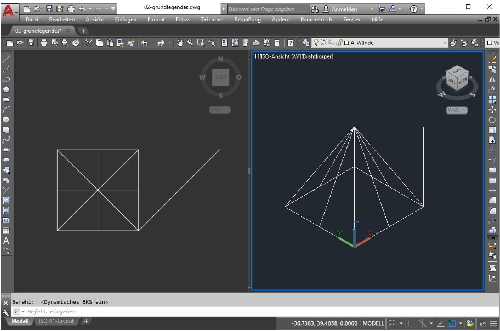

# AutoCAD erster Start und Einrichten

Wenn AutoCAD von einem Nutzer zum ersten mal gestartet wird richtet das Programm das nutzerspezifische Profil ein, hierzu gehören die Gestaltung der Menüleisten, Schraffur- und Linienbibliotheken und Etliches mehr. In der Version 2020 erfolgt dies in einem übersichtlichen Fenster mit der Auswahl der bereits installierten Version und den jeweiligen Bereichen. Nach der zuweisung der Dateiendung DWG erfolgt die Angabe des Lizenztyps, wählen Sie: **Einzelplatz** und melden Sie sich mit ihrem Nutzernamen, bzw. der hinterlegten E-Mail und Ihrem Passwort des angelegten Accounts an oder mit vorliegender Seriennummer die Option Lizenz/Seriennummer. Anschließend ist AutoCAD ohne weiteren Kommentar bereit. Haben Sie keine Internetverbindung läuft die 30-Tage-Lizenz.

Bei älteren Versionen (bis mind. 2018)  erfolgt bei der Installation die Abfrage der Seriennummer bei einer Einzelplatzinstallation oder der Adresse des Lizenzservers bei einer Netzwerkinstallation. Danach startet das Programm mit einem Startfenster, in dem eine neue Zeichnung gestartet, auf vorangehende Zeichnungen oder auf Infos von Autodesk zugegriffen werden kann.

| Anmerkungen zum Layout bei Anweisungen |
|----|
| - Menüpfade werden mit schlichten Pfeilen dargestellt: "Datei -> Speichern". |
| - Tastaturkürzel, die ich persönlich gerne Nutze, in Spitzklammern je Taste: \<strg> + \<c>. |
| - Schalter auf Formularen werden in [] gesetzt: [OK] |
| - Zur Darstellung von Befehlen im Text nutze ich die in Markdown übliche Darstellung von Code bzw. Anweisungen an den Computer: ```anweisung```. Diese Befehle können einfach getippt werden und erscheinen mit automatischer Ergänzung an der Maus oder in der Kommandozeile von AutoCAD. Bei optionalen oder nachfolgenden Anweisungen werden die Tastaturkürzel in GRossbuchstaben gesetzt und farblich hervorgehoben, z.B. **Z**oom -> **FE**nster. Ich verwende deshalb beides in Kombination: ```POLYLINIE``` oder ```PLinie```, bei der Kurzform aber ```pl``` da Kleinbuchstaben ebenfalls gültig und in der täglichen Arbeit viel schneller zu schreiben sind. |
| - Alle Befehle können mit vorangestelltem Unterstrich in der englischen Originalversion aufgerufen werden ```_POLYLINE``` |

**Für die effiziente Arbeit in AutoCAD ist eine Maus mit Skrollrad unabdingbar. **



## Standard Programmfensters 

Auch bei der Gestaltung des Programmfensters haben sich in den letzten Jahren zahlreiche Details verändert. Zudem werden bei einem Upgrade alte Nutzereinstellungen übernommen, bedenken Sie beides bitte wenn Sie Widersprüche in Ihrer Ansicht und meinem folgenden Text erkennen. Nach dem **Starten einer Zeichnung** gliedert sich das Programmfenster wie folgt:

- Rechts oben steht neben einer Silhouette Ihr Anmeldename, hier werden Konto- und Lizenzinformationen angezeit und kann eine Abmeldung vom Lizenzdienst erfolgen. 
- "**A**"utoCAD. Hinter dem von MS Office-Programmen bekannten Design verbergen sich grundlegende Aufgaben, teils redundant mit bisher üblichen Zugängen über das Menü.
- Links oben befindet sich die "Hauptmenüleiste" für zentrale Aufgaben, z.B. Neue Datei, Speichern etc. Die Leiste kann mit einem *drop down* am rechten Rand erweitert werden.
- Das "Ribbon" (Iconleiste) nimmt den größten Bereich des oberen Fensterrandes ein. Es bietet einen komplexen Zugriff auf vielfältigste Funtionen in diversen Aufgabenbereichen.
- Das eigentliche Zeichenfenster wird durch eine Leiste von Reitern für jede aktive Zeichnung eingeleitet, dies schließt das Startfenster ein. Das "+" ermöglicht das schnelle Ergänzen einer neuen Zeichnung (alternativ \<strg> + \<n>).
- Rechts oben im Zeichenfenster befindet sich der ***view cube***, er bietet eine leichte Navigation im 3D-Raum der Zeichnung. Umnittelbar darunter wird in einem *drop down* das aktive **Koordinatensystem** angezeigt und kann gewechselt werden.
- Links unten im Zeichenfenster befindet sich ein Koordinatensymbol das von der jeweils gewälten Sicht und dem Koordinatensystem abhängt.
- Am unteren Rand des Zeichenfensters befindet sich eine Befehlszeile, Tastatureingaben werden direkt an der Maus oder in dieser Zeile dargestellt und jeweils zu bekannten Befehlen ergänzt. 
- Tippen Sie einfach mal ```pl``` für Polylinie + \<enter> und zeichnen Sie mit der maus eine Polylinie mit einigen Mausklicks. 
  - Rufen Sie interaktiv das Kontextmenü (rechte Mausklick) auf, schließen Sie es mit \<esc>.
  - Zoomen  Sie während des Zeichnens mit dem Scroll-Rad der Maus hinein (Drehrichtung nach vorne / vorwärts) oder hinaus (Drehrichtung nach hinten / rückwärts). Die Drehbewegung simuliert Ihre Bewegung im Verhältnis zum Modell als 1:1-Abbild der realen Welt.
  - Berühren Sie bereits vorhandene Elemente und beachten Sie die Symboländerung am Mauszeiger.
  - Beenden Sie das Zeichnen mit \<esc> oder \<enter>
- Am unteren Rand des Programmfensters befindet sich ein Reiter für das Modell, also die Zeichnung, gefolgt von zwei Reitern für Layout, die im Moment des Aktivierens mit einer einfachen Darstellung des Modells gefüllt werden. Zahlreiche Layout je Zeichnung können in diverser Komplexität und Format gestaltet werden.
- Am rechten unteren Programmfenster sehen Sie zahlreiche weitere Symbole, u.a. für **Objektfang**, **Orthomodus** oder vordefinierte Menülayouts (Zahnrad). Ein kleiner Auszug:
  - Mit dem Menü-Icon (hor. Linien) am rechten Rand kann dieser Bereich gestaltet werden, aktivieren Sie z.B. die Koordinatenanzeige.
  - Modell / Papier: Erlaubt in einem Layout das "Springen" in das Modell hinein, der Rahmen wird fett dargestellt Sie bewegen sich jetzt im Modell (vgl. Koordinaten). Mit Papier befinden Sie sich wieder auf dem Layout. Wechseln Sie nachfolgend links unten mit dem Reiter "Modell" wieder zum Modell.
  - **Fangmodus**: Sorgt für definierte Sprünge der Maus in einem Raster. Wird über das *drop down* eingerichtet.
  - **Orthomodus**: Eine ausschließlich horizontale oder vertikale Bewegung ist möglich.
  - **Objektfang**: Fängt während des Zeichnens die aktivierten Punkte (Knoten, Mittelpunkt, Zentrum, Lot etc.). 

Einige dieser Zeichenhilfen habe ich nie vermisst oder brauche diese sehr selten und blende diese für mich aus. Ich gewinne zwar keine Zeichenfläche, aber der Arbeitsbereich wird dadurch entschlackt.  

Die drei letzten Funktionen können mit den Funktionstasten \<F9>, \<F8> und \<F3> auch interaktiv, also während des Zeichnens eingeschaltet oder mit der Maus im *drop down* verändert werden.

## Programmfenster einrichten

Die anforderungsgerechte Gestaltung der Programmoberfläche ist gut und die pauschale Aussage 'wir machen das jetzt alles anders' ist sicher schlecht. Ich erläutere nachfolgend meine persönlichen Vorlieben nur als Beispiel. Diese sind in der Arbeit mit AutoCAD seit der Version R12 (ab 1996) überwiegend auf der Kommandozeile begründet und eher "retro". Also Lesen Sie erst nur und machen sich ein eigenes Bild. 

Für den als Videokonferenz erfolgten Kurs ist eine einheitlich Gestaltung der Oberfläche natürlich eine Erleichterung. Da ich vorwiegend mit Tastaturbefehlen arbeite liegen die größten, mir bekannten Probleme in der Verwendung bzw. Deaktivierung des DYNMODE (s.u.). Alles andere ist eher Design und persönlicher *workflow*.

### Startfenster

Mich stört das Startfenster: 1. Starte ich sonst direkt in eine neue Zeichnung oder rufe eh eine vorangehende Zeichnung über das Menü auf. 2. Ist das Fenster die ganze Zeit aktiv und mit \<alt> + \<tab> lande ich unnötig oft in diesem überflüssigen Bereich.

Mit ```STARTMODE``` rufe ich diese Option auf und setze den Wert von "1" auf "0".

### Traditionelle Menüleiste

Das Ribbon braucht viel Platz, zumal auf einem Notebook im Gelände, und die Masse der dargestellten Befehle brauche ich selten bis nie. Wenn ich nicht mit der Tastatur arbeite gehe ich über das traditionelle Menü, das sich mir mit Text viel leichter erschließt als die vielen bunten Bildchen.

In dem *drop down* am rechten Rand der Hauptmenüleiste oben links kann ich die traditionelle Menüleiste einblenden.

### Ribbon

Mit der traditionellen Menüleiste ist das Ribbon für mich überflüssig. Über "Extras -> Paletten -> Multifunktionsleiste" deaktiviere ich es.

### Werzeugkästen

Einige "alte" Werkzeugkästen bieten tatsächlich einen schnellen Zugang zu Informationen oder ermöglichen ein dynamisches Arbeiten, so z.B. das Layermenü. Diese Werkzeugkästen aktiviere ich nachfolgend. Ich gehen dazu über "Extras -> Werkzeugkästen -> AutoCAD" und wählen aus der langen Liste folgende aus:

 - Standard
 - Layer
 - Eigenschaften
 - Zeichnen
 - Ändern
 - Abfrage
 
Diese Werkzeugkästen schiebe ich an die mir gewohnten Positonen am linken (Zeichnen), rechten (Ändern, Abfrage) und oberen Fensterrand.

### Befehlszeile

Die Befehlszeile liegt als Fenster am unteren Rand des Zeichenbereiches und kann frei positioniert oder am unteren Rand fest  angedockt werden. Folgende Aspekte sind zu bedenken: Meine Befehle sind sehr kurz, allerdings sind die teils folgenden Option oder Rückgabewerte lang, also nicht zu schmal machen. Andererseits ist die volle Breite eines Widescreens übertrieben. Mit \<F2> können Sie das Fenster jederzeit hochklappen und die Befehlshistorie sehen, das funktioniert auch, wenn Sie die Befehlszeile ganz geschlossen haben. Um die Befehlszeige wieder anzuzeigen drücken Sie \<strg> + \<9>. 
 
Diese **neu gestaltete Oberfläche speichern** ich unter einem neuen Namen. Dafür öffne ich das *drop down* bei dem Zahnrad-Icon rechts unten und wähle "Aktuelles speichern unter ...". 

## Weitere Programmoptionen

Über "Extras -> Optionen" können sehr viele Parameter für AutoCAD konfiguriert werden. Ich erläutere nachfolgend nur einige wenige und für mich wichtige Optionen. Diese Parameter gelten für jeden zukünftigen Programmaufruf und sind meist sofort aktiv. Das neue Fenster wird über Register in diverse Bereiche gegliedert.

### Öffnen und Speichern 

Ich verwende auch ältere Versionen von AutoCAD. Um keine lästigen Versionsprobleme  zu bekommen oder stets an das *downgrading* denken zu müssen stelle ich hier die zu Speichernde Version auf AutoCAD 2010. Eine weitere interessante Option ist das Zeitintervall der automatischen Sicherung.

### Anzeige

Aus diversen Gründen, u.a. Kontrast bei Tageslicht, bevorzuge ich im Modell einen schwarzen Hintergrund mit hellen Linien; jüngere Versionen von AutoCAD sind trendgemäß dunkel designed. Das Farbschema für das Menü und die Werkzeugleisten steht auf Dunkel. Etwas unterhalb mit [Farben] kann ich auch die Farben für den Hintergrund im Modell- und Papierbereich verändern. Für den "2D-Modellbereich" in dem ich überwiegend arbeite wähle ich einen "Einheitlichen Hintergrund" mit der Farbe Schwarz oder einem sehr dunklen Grau aus den Indexfarben von AutoCAD (250, 251).

Das Fadenkreuz der Maus geht zwischen vielen Linien gerne unter, deshalb stelle ich die **Fadenkreuzgröße** auf 100 und erhalte ein Fadenkreuz über das gesamten  Fenster.

### Dateien

Bei den Pfadangaben nutze ich bisweilen den Hinweis auf "Suchpfad für Projektdateien", um Probleme mit externen Referenzen zu lösen (XRef). Und den Standardpfad zu den automatischen angelegten Sicherungen finden Sie ebenfalls hier: C:\\Users\\\<user>\\appdata\\local\\temp\\

