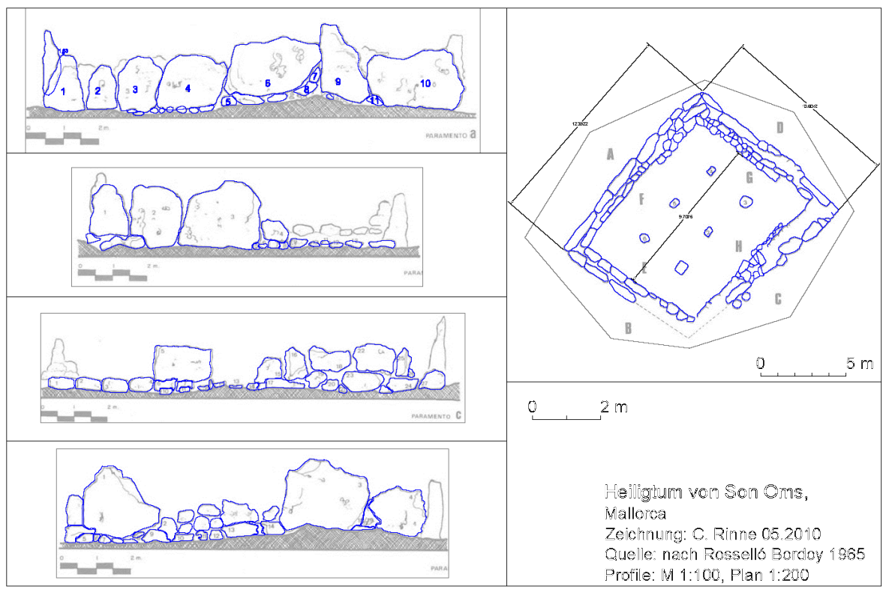

# Vorbemerkung {-}

Der Kurs sollte im Sommersemester 2020 im PC-Labor des Institutes für Ur- und Frühgeschichte der Christian-Abrechts-Universität zu Kiel stattfinden. Durch die Corona-Virus-Pandemie (covid-19) musste er dann ausschließlich mittels Videokonferenz erfolgen. Da die technischen Einschränkungen, wie z.B. nur ein Monitor, schlechtere Bildqualität und eingeschränkte Kommunikation zu Nachbarn und Dozenten, eine besondere Herausforderung vor allem bei der Arbeit in einer Software wie CAD darstellen, wurden alle Unterichtseinheiten zu beginn als Video dann konsequent als umfangreiches Skript ausgeführt. Dabei liegt der Schwerpunkt auf der schriftlichen Erläuterung und nicht auf Bildern, da die Abläufe in der Übung ja durchgeführt wurden. Das Ziel war eine Handreichung, die eine Grundlage für die Vorbereitung und die Nachbereitung der jeweiligen Stunde darstellen sollte. Dies schließt eine selbständige Erarbeitung des Inhaltes nicht aus, diese mag aber wegen der fehlenden Bilder weniger intuitiv erscheinen.

| Anmerkung |
|----|
| Statt der im PC-Labor in Kiel installierten Version AutoCAD 2010 wurde bei der Übung die Version AutoCAD 2018 verwendet. Die damit einhergehenden Veränderungen im Menü aber auch von einzelnen Befehlen stellten auch für mich als Dozent eine Übung dar.| 
| Geringfügig überarbeitete Version für den Workshop **ArchaeWorks 2023 in Kiel** |

## Lernziele {-}

Behandelt werden diverse Optionen zur klaren und einheitlichen Strukturierung der Datei, so z.B. Layer und Layerfilter, externe Referenzen, Blöcke mit Attributen, Planerstellung, Datenexport und Interoperabilität mit Fokus auf GIS. Damit wird der allegemeine Einstieg in AutoCAD und die Grundlagen beider vorgenannten Interessensbereiche, Dokumentation einer Ausgrabung und Nachnutzung in der Auswertung, behandelt.

## Software {-}

Zum Einsatz kommmt AutoCAD der Firma Autodesk. Im PC-Labor der Ur- und Frühgeschichte steht AutoCAD 2010 zur Verfügung. Für die Arbeit am eigenen Rechner wird eine kostenlose Studentenversion von AutoCAD 2018 genutzt. Die aktuelleren Version von AutoCAD, stellen zunehmend sehr hohe Hardwareanforderungen (u.a. mind. 8 GB besser 16 GB RAM oder 4 bis 10 GB Festplattenspeicher). Informieren Sie sich bitte eigenständig vorab, ob Ihr Rechner die notwendigen [Systemanforderungen](https://knowledge.autodesk.com/de/support/autocad/troubleshooting/caas/sfdcarticles/sfdcarticles/DEU/System-requirements-for-AutoCAD.html) erfüllt. Für die Nutzung dieser kostenlosen Studentenversion muss mit einer stu(denten)-E-Mail der Uni ein Account bei Autodesk eingerichtet werden. Weitere Informationen hierzu finden Sie bei [Autodesk](https://knowledge.autodesk.com/de/customer-service/account-management/education-program/free-education-access). Die jüngste Authentifizierung nutzt [Shibbolet-Authentifizierung](https://de.wikipedia.org/wiki/Shibboleth), informieren Sie sich hierzu ggf. bei dem Rechenzentrum Ihrer Bildungseinrichtung.

## Warum CAD und warum AutoCAD?  {-}

Die Schnittstelle zwischen Archäologie und CAD (Computer Aided Design) ist ohne jeden Zweifel die archäologische Ausgrabung. Es ist vor allem die Einführung optischer Vermessungsgeräte auf den Ausgrabungen, die seit den 1990ern für eine rapide Zunahme genuin digitaler Grabungspläne sorgt. Investitionen in diesem Bereich sind teuer, werden nachhaltig genutzt und haben über die Jahre oft zu abgestimmten Handlungsrichtlinien  in Denkmalämtern und Grabungsfirmen geführt.

Es gibt mehrere CAD Programme, die aber fast ausnahmslos eines gemeinsam haben: sie sind proprietär und damit kostenpflichtig. Eine freie Ausnahme mit echtem 3D und vielen interessanten Optionen ist sicher [freeCAD](https://www.freecadweb.org/). Dazu gehört eine aktive Entwicklergemeinschaft auf [github](https://github.com/FreeCAD), die den überwiegend in c++ und Python geschriebene Code fortwährend weiterentwickelt. Die Unterschiede zu AutoCAD sind für den Anwender aber enorm, so dass eine Umstellung  von AutoCAD zu freeCAD sehr schwer fällt. AutoCAD von Autodesk ist im Bereich CAD ein Marktführer und in der Archäologie wegen diverser ergänzender und hierauf aufsetzender Software sicher besonders verbreitet. Als Beispiele seien genannt:

- [FARO](https://www.faro.com/) (ehem. kubit) mit TachCAD für die direkte Kommunikation zum Tachymeter und PhotoPlan für die Messbildentzerrung. Die Software, bis 2018 FAROBox, jetzt FARO As-Built spezialisiert sich zunehmend auf die 3D-Scanner und das Baugewerbe.
- [Arctron](https://www.arctron.de) mit der Anwendung ArchäoCAD.

Es gibt also im wesentlichen zwei Gründe, sich mit AutoCAD zu befassen:

- Sie wollen auf archäologischen Ausgrabungen souverän und effizient die Dokumentation bewältigen.
- Sie wollen mit den genuinen in CAD erstellten, digitalen Plänen von Ausgrabungen in Ihrem Forschungsprojekt arbeiten. Auch in diesem Fall ist die versierte Sichtung der Daten im genuinen Kontext von Vorteil.

Natürlich gewinnen Geographische Informationssystem (GIS) auch im Bereich der Grabungsdokumentation an Bedeutung, vor allem im Bereich der Messbildentzerrung stehen absolut equivalente Algorithmen zur Verfügung. Dennoch bestehen weiterhin grundlegende Unterschiede zwischen CAD und einem GIS, die erst ganz allmählich durch grundsätzliche 3D-Funktionalitäten und Software für die *on-the-fly* Schnittstelle zum Tachy, z.B. [Tachy2GIS](https://github.com/Archaeological-Museum-Hamburg/Tachy2GIS), überbrückt werden.

| Anmerkungen zum Layout bei Anweisungen |
|----|
| - Menüpfade werden mit schlichten Pfeilen dargestellt: "Datei -> Speichern". |
| - Tastaturkürzel, die ich persönlich gerne Nutze, in Spitzklammern je Taste: \<strg> + \<c>. |
| - Schalter auf Formularen werden in [] gesetzt: [OK] |
| - Zur Darstellung von Befehlen im Text nutze ich die in Markdown übliche Darstellung von Code bzw. Anweisungen an den Computer: ```anweisung```. Diese Befehle können einfach getippt werden und erscheinen mit automatischer Ergänzung an der Maus oder in der Kommandozeile von AutoCAD. Bei optionalen oder nachfolgenden Anweisungen werden die Tastaturkürzel in GRossbuchstaben gesetzt und farblich hervorgehoben, z.B. **Z**oom -> **FE**nster. Ich verwende deshalb beides in Kombination: ```POLYLINIE``` oder ```PLinie```, bei der Kurzform aber ```pl``` da Kleinbuchstaben ebenfalls gültig und in der täglichen Arbeit viel schneller zu schreiben sind. |
| - Alle Befehle können mit vorangestelltem Unterstrich in der englischen Originalversion aufgerufen werden ```_POLYLINE``` |

# AutoCAD Download und Installation

## Download

Die Firma Autodesk bietet Studierenden und Dozenten eine kostenlose Version der Software. Die Nutzungsbedingungen haben sich in den vergangenen Jahren stets ein wenig verändert, eine Grundvoraussetzung ist aber die nicht-kommerzielle Verwendung für die Ausbildung. Weitere Informationen finden Sie bei [Autodesk](https://knowledge.autodesk.com/de/customer-service/account-management/education-program/free-education-access). Für den Zugang müssen Sie sich einen "[*Education Account*](https://knowledge.autodesk.com/de/customer-service/account-management/education-program/create-education-account/create-account-students-educators)" anlegen. Zur Authentifizierung reicht für gewöhnlich eine E-Mail der Universität, aktuell wird auch auf die [Shibbolet-Authentifizierung](https://de.wikipedia.org/wiki/Shibboleth) zurückgegriffen (CIM an der CAU). Informieren Sie sich hierzu bitte auf den Informationsseiten Ihrer Universität. Dieser Account bei Autodesk wird vor dem *download* auf der Seite zu den [freien Softwareangeboten von Autodesk](https://www.autodesk.de/education/edu-software/overview?sorting=featured&page=1) erstellt. Wählen Sie auf dieser Seite "AUTOCAD", richten Sie sich einen Account ein oder melden Sie sich an. Wählen Sie unterhalb von "AUTOCAD" das OS, die Version (Jahr) und Sprache wählen und die Installation oder den Download starten.

| Anmerkung |
|----|
| **Der Vorgang des Download hat sich in den letzten Jahren beständig verändert.** |
| Achten Sie auf die jeweilige länderspezifische Seite (DE US), es bestehen aktuell Unterschiede in den hinterlegten Versionen der Software. US: 2022 - 2019, DE 2021 - 2018. |
| Über den Bildungs-Account werden nur bis zu drei vorangehende Versionen angeboten [knowledge.autodesk.com](https://knowledge.autodesk.com/customer-service/account-management/users-software/previous-versions/request-previous-version-license). |
| Da Sie sich für den Download der Software einen Account angelegt haben, können Sie auf eine umfangreiche Sammlung an Lehrmitteln auf der Seite von AutoDesk zugreifen [Link]( https://knowledge.autodesk.com/de).|

## Installation & Lizenz

Die Installation ist, je nach Netztanbindung, ein langer oder sehr langer Prozess. 
Die Installation erfolgt mit allgemein üblichen Schritten wie der Lizenzanerkennung und kann auch individuell angepasst werden ("Klicken Sie hier zum Öffnen der Konfiguration"). Mit der Installation von AutoCAD sollen drei weitere Programme installiert werden:

- [Autodesk Exchange App Manager](http://download.autodesk.com/us/exchange/appmanager/AppManager_HELP_ENU.html): Dieser dient dem Download und der Aktualisierung von Apps vermutlich aus dem Autodesk eigene [App-Store](https://apps.autodesk.com/en)
- Exchange - Plugin für verfügbare Apps: Durch dieses Plugin wird eine Registerkarte der Multifunktionsleiste hinzugefügt, diese unterstützt oder enthält empfohlene Apps. 
- Autodesk AutoCAD Performance Reporting Tool: Durch dieses Plugin können Sie Autodesk Leistungsprobleme bei der Verwendung von AutoCAD melden.
- Installationstyp: Standard oder Benutzerdefiniert
- Optional: Express Tools.

Ich behalte die Vorgaben und starte die eigentliche Installation.

 **Ihre Lizenzdaten (Seriennummer / Schlüssel) finden Sie in ihrem Nutzerkonto bei AutoCAD.**
 
Nach der Installation können Sie AutoCAD mit dem Programm "Dienstpramm  für Lizenzübertragung" Längerfristig lizenzieren. Ansonsten werden Sie beim ersten Programmstart aufgefordert zwischen Einzelplatzlizenz oder Seriennummer zu wählen. Wählen Sie Seriennummer und tragen Sie die Werte ein. Die wahl von "Einzelplatzlizenz" erfordert eine Internetverbindung und die Anmeldung bei AutoCAD mit Ihren Logindaten. Sie können dann auch nachträglich in AutoCAD die Lizenzdaten eintragen. Gehen Sie hierfür im Menü rechts oben auf Ihr "Namenskürzel -> Lizenz verwalten" wäheln Sie dort "Lizenztyp ändern" und folgen den weiteren Anweisungen. 

# AutoCAD erster Start und Einrichten

Wenn AutoCAD von einem Nutzer zum ersten mal gestartet wird richtet das Programm das nutzerspezifische Profil ein, hierzu gehören die Gestaltung der Menüleisten, Schraffur- und Linienbibliotheken und Etliches mehr. In der Version 2020 erfolgt dies in einem übersichtlichen Fenster mit der Auswahl der bereits installierten Version und den jeweiligen Bereichen. Nach der zuweisung der Dateiendung DWG erfolgt die Angabe des Lizenztyps, wählen Sie: **Einzelplatz** und melden Sie sich mit ihrem Nutzernamen, bzw. der hinterlegten E-Mail und Ihrem Passwort des angelegten Accounts an oder mit vorliegender Seriennummer die Option Lizenz/Seriennummer. Anschließend ist AutoCAD ohne weiteren Kommentar bereit. Haben Sie keine Internetverbindung läuft die 30-Tage-Lizenz.

Bei älteren Versionen (bis mind. 2018)  erfolgt bei der Installation die Abfrage der Seriennummer bei einer Einzelplatzinstallation oder der Adresse des Lizenzservers bei einer Netzwerkinstallation. Danach startet das Programm mit einem Startfenster, in dem eine neue Zeichnung gestartet, auf vorangehende Zeichnungen oder auf Infos von Autodesk zugegriffen werden kann.

**Für die effiziente Arbeit in AutoCAD ist eine Maus mit Skrollrad unabdingbar. **


## Standard Programmfensters 

Auch bei der Gestaltung des Programmfensters haben sich in den letzten Jahren zahlreiche Details verändert. Zudem werden bei einem Upgrade alte Nutzereinstellungen übernommen, bedenken Sie beides bitte wenn Sie Widersprüche in Ihrer Ansicht und meinem folgenden Text erkennen. Nach dem **Starten einer Zeichnung** gliedert sich das Programmfenster wie folgt:

- Rechts oben steht neben einer Silhouette Ihr Anmeldename, hier werden Konto- und Lizenzinformationen angezeit und kann eine Abmeldung vom Lizenzdienst erfolgen. 
- "**A**"utoCAD. Hinter dem von MS Office-Programmen bekannten Design verbergen sich grundlegende Aufgaben, teils redundant mit bisher üblichen Zugängen über das Menü.
- Links oben befindet sich die "Hauptmenüleiste" für zentrale Aufgaben, z.B. Neue Datei, Speichern etc. Die Leiste kann mit einem *drop down* am rechten Rand erweitert werden.
- Das "Ribbon" (Iconleiste) nimmt den größten Bereich des oberen Fensterrandes ein. Es bietet einen komplexen Zugriff auf vielfältigste Funtionen in diversen Aufgabenbereichen.
- Das eigentliche Zeichenfenster wird durch eine Leiste von Reitern für jede aktive Zeichnung eingeleitet, dies schließt das Startfenster ein. Das "+" ermöglicht das schnelle Ergänzen einer neuen Zeichnung (alternativ \<strg> + \<n>).
- Rechts oben im Zeichenfenster befindet sich der ***view cube***, er bietet eine leichte Navigation im 3D-Raum der Zeichnung. Umnittelbar darunter wird in einem *drop down* das aktive **Koordinatensystem** angezeigt und kann gewechselt werden.
- Links unten im Zeichenfenster befindet sich ein Koordinatensymbol das von der jeweils gewälten Sicht und dem Koordinatensystem abhängt.
- Am unteren Rand des Zeichenfensters befindet sich eine Befehlszeile, Tastatureingaben werden direkt an der Maus oder in dieser Zeile dargestellt und jeweils zu bekannten Befehlen ergänzt. 
- Tippen Sie einfach mal ```pl``` für Polylinie + \<enter> und zeichnen Sie mit der maus eine Polylinie mit einigen Mausklicks. 
  - Rufen Sie interaktiv das Kontextmenü (rechte Mausklick) auf, schließen Sie es mit \<esc>.
  - Zoomen  Sie während des Zeichnens mit dem Scroll-Rad der Maus hinein (Drehrichtung nach vorne / vorwärts) oder hinaus (Drehrichtung nach hinten / rückwärts). Die Drehbewegung simuliert Ihre Bewegung im Verhältnis zum Modell als 1:1-Abbild der realen Welt.
  - Berühren Sie bereits vorhandene Elemente und beachten Sie die Symboländerung am Mauszeiger.
  - Beenden Sie das Zeichnen mit \<esc> oder \<enter>
- Am unteren Rand des Programmfensters befindet sich ein Reiter für das Modell, also die Zeichnung, gefolgt von zwei Reitern für Layout, die im Moment des Aktivierens mit einer einfachen Darstellung des Modells gefüllt werden. Zahlreiche Layout je Zeichnung können in diverser Komplexität und Format gestaltet werden.
- Am rechten unteren Programmfenster sehen Sie zahlreiche weitere Symbole, u.a. für **Objektfang**, **Orthomodus** oder vordefinierte Menülayouts (Zahnrad). Ein kleiner Auszug:
  - Mit dem Menü-Icon (hor. Linien) am rechten Rand kann dieser Bereich gestaltet werden, aktivieren Sie z.B. die Koordinatenanzeige.
  - Modell / Papier: Erlaubt in einem Layout das "Springen" in das Modell hinein, der Rahmen wird fett dargestellt Sie bewegen sich jetzt im Modell (vgl. Koordinaten). Mit Papier befinden Sie sich wieder auf dem Layout. Wechseln Sie nachfolgend links unten mit dem Reiter "Modell" wieder zum Modell.
  - **Fangmodus**: Sorgt für definierte Sprünge der Maus in einem Raster. Wird über das *drop down* eingerichtet.
  - **Orthomodus**: Eine ausschließlich horizontale oder vertikale Bewegung ist möglich.
  - **Objektfang**: Fängt während des Zeichnens die aktivierten Punkte (Knoten, Mittelpunkt, Zentrum, Lot etc.). 

Einige dieser Zeichenhilfen habe ich nie vermisst oder brauche diese sehr selten und blende diese für mich aus. Ich gewinne zwar keine Zeichenfläche, aber der Arbeitsbereich wird dadurch entschlackt.  

Die drei letzten Funktionen können mit den Funktionstasten \<F9>, \<F8> und \<F3> auch interaktiv, also während des Zeichnens eingeschaltet oder mit der Maus im *drop down* verändert werden.

## Programmfenster einrichten

Die anforderungsgerechte Gestaltung der Programmoberfläche ist gut und die pauschale Aussage 'wir machen das jetzt alles anders' ist sicher schlecht. Ich erläutere nachfolgend meine persönlichen Vorlieben nur als Beispiel. Diese sind in der Arbeit mit AutoCAD seit der Version R12 (ab 1996) überwiegend auf der Kommandozeile begründet und eher "retro". Also Lesen Sie erst nur und machen sich ein eigenes Bild. 

Für den als Videokonferenz erfolgten Kurs ist eine einheitlich Gestaltung der Oberfläche natürlich eine Erleichterung. Da ich vorwiegend mit Tastaturbefehlen arbeite liegen die größten, mir bekannten Probleme in der Verwendung bzw. Deaktivierung des DYNMODE (s.u.). Alles andere ist eher Design und persönlicher *workflow*.

### Startfenster

Mich stört das Startfenster: 1. Starte ich sonst direkt in eine neue Zeichnung oder rufe eh eine vorangehende Zeichnung über das Menü auf. 2. Ist das Fenster die ganze Zeit aktiv und mit \<alt> + \<tab> lande ich unnötig oft in diesem überflüssigen Bereich.

Mit ```STARTMODE``` rufe ich diese Option auf und setze den Wert von "1" auf "0".

### Traditionelle Menüleiste

Das Ribbon braucht viel Platz, zumal auf einem Notebook im Gelände, und die Masse der dargestellten Befehle brauche ich selten bis nie. Wenn ich nicht mit der Tastatur arbeite gehe ich über das traditionelle Menü, das sich mir mit Text viel leichter erschließt als die vielen bunten Bildchen.

In dem *drop down* am rechten Rand der Hauptmenüleiste oben links kann ich die traditionelle Menüleiste einblenden.

### Ribbon

Mit der traditionellen Menüleiste ist das Ribbon für mich überflüssig. Über "Extras -> Paletten -> Multifunktionsleiste" deaktiviere ich es.

### Werzeugkästen

Einige "alte" Werkzeugkästen bieten tatsächlich einen schnellen Zugang zu Informationen oder ermöglichen ein dynamisches Arbeiten, so z.B. das Layermenü. Diese Werkzeugkästen aktiviere ich nachfolgend. Ich gehen dazu über "Extras -> Werkzeugkästen -> AutoCAD" und wählen aus der langen Liste folgende aus:

 - Standard
 - Layer
 - Eigenschaften
 - Zeichnen
 - Ändern
 - Abfrage
 
Diese Werkzeugkästen schiebe ich an die mir gewohnten Positonen am linken (Zeichnen), rechten (Ändern, Abfrage) und oberen Fensterrand.

### Befehlszeile

Die Befehlszeile liegt als Fenster am unteren Rand des Zeichenbereiches und kann frei positioniert oder am unteren Rand fest  angedockt werden. Folgende Aspekte sind zu bedenken: Meine Befehle sind sehr kurz, allerdings sind die teils folgenden Option oder Rückgabewerte lang, also nicht zu schmal machen. Andererseits ist die volle Breite eines Widescreens übertrieben. Mit \<F2> können Sie das Fenster jederzeit hochklappen und die Befehlshistorie sehen, das funktioniert auch, wenn Sie die Befehlszeile ganz geschlossen haben. Um die Befehlszeige wieder anzuzeigen drücken Sie \<strg> + \<9>. 
 
Diese **neu gestaltete Oberfläche speichern** ich unter einem neuen Namen. Dafür öffne ich das *drop down* bei dem Zahnrad-Icon rechts unten und wähle "Aktuelles speichern unter ...". 

## Weitere Programmoptionen

Über "Extras -> Optionen" können sehr viele Parameter für AutoCAD konfiguriert werden. Ich erläutere nachfolgend nur einige wenige und für mich wichtige Optionen. Diese Parameter gelten für jeden zukünftigen Programmaufruf und sind meist sofort aktiv. Das neue Fenster wird über Register in diverse Bereiche gegliedert.

### Öffnen und Speichern 

Ich verwende auch ältere Versionen von AutoCAD. Um keine lästigen Versionsprobleme  zu bekommen oder stets an das *downgrading* denken zu müssen stelle ich hier die zu Speichernde Version auf AutoCAD 2010. Eine weitere interessante Option ist das Zeitintervall der automatischen Sicherung.

### Anzeige

Aus diversen Gründen, u.a. Kontrast bei Tageslicht, bevorzuge ich im Modell einen schwarzen Hintergrund mit hellen Linien; jüngere Versionen von AutoCAD sind trendgemäß dunkel designed. Das Farbschema für das Menü und die Werkzeugleisten steht auf Dunkel. Etwas unterhalb mit [Farben] kann ich auch die Farben für den Hintergrund im Modell- und Papierbereich verändern. Für den "2D-Modellbereich" in dem ich überwiegend arbeite wähle ich einen "Einheitlichen Hintergrund" mit der Farbe Schwarz oder einem sehr dunklen Grau aus den Indexfarben von AutoCAD (250, 251).

Das Fadenkreuz der Maus geht zwischen vielen Linien gerne unter, deshalb stelle ich die **Fadenkreuzgröße** auf 100 und erhalte ein Fadenkreuz über das gesamten  Fenster.

### Dateien

Bei den Pfadangaben nutze ich bisweilen den Hinweis auf "Suchpfad für Projektdateien", um Probleme mit externen Referenzen zu lösen (XRef). Und den Standardpfad zu den automatischen angelegten Sicherungen finden Sie ebenfalls hier: C:\\Users\\\<user>\\appdata\\local\\temp\\


# Grundlegendes und erstes Zeichnen

Öffnen Sie eine neue Zeichnung (\<str> + \<n>), wählen Sie in diesem Fall die Vorlage "Tutorial-mArch.dwt". Die neue Zeichnung wird im Layout mit einem Koordinatenrahmen und weiteren Layoutelementen geöffnet.

## Grundlegende Konzepte und Handhabung

Hier geht es überwiegend um die Interaktion mit dem Programm und grundlegende Konzepte, z.B. das Koordinatensystem. AutoCAD ist ein technisches Zeichenprogramm, versetzen Sie sich in den Geometrieuntericht Ihrer Schulzeit, nehmen Sie im Geist Geodreieck und Zirkel zur Hand, oder wenn Sie es kennen einen professionellen Zeichentisch, damit haben Sie eine für den Anfang brauchbare Einstellung zur Arbeit in AutoCAD. AutoCAD ist kein Malprogramm.

### Zoomen und Bewegen

Mit gedrücktem Skrollrad können Sie das dargestellte Papier im Layout oder das Modell im Modellbereich im jeweiligen Fenster verschieben. Drehen Sie das Skrollrad von sich weg zoomen Sie hinein, umgekehrt zoomen Sie heraus. Das Rad simuliert also die eigene Bewegung in das Modell hinein oder heraus. In der Kartographie eines GIS ist das oft umgekehrt, da kommt das Papier zum sitzenden Geographen oder eben der Berg zum Propheten. Beim Zoomen bestimmt die Mausposition den Zoom-Fokus, eine schnelle Bewegung auf dem Plan ist durch gezieltes raus- und reinzoomen möglich. Testen Sie das mal im aktiven Layoutbereich, raus und gezielt rein.

Der Befehl ```ZOOM``` zieht weitere Optionen nach sich, die mit den jeweiligen Großbuchstaben ausgewählt werden können. Der Subbefehl ```Grenzen``` zoomed auf die Grenzen der Zeichnung und offenbart bisweilen Fehler in der Zeichnung.

| Anmerkung |
|----|
| Beim Zoomen können Sie an eine Dimensionsgrenze stoßen, Sie kommen einfach nicht weiter heraus. Das liegt an der Dimensionierung des Zeichenbereiches, sie sind im übertragen Sinn an die Blatt- oder Tischgrenze gestoßen. Tippen Sie ```REGENerieren``` und die Dimension der Zeichnung wird neu gesetzt.|

### Modell und Layoutbereich

Wechseln Sie links unten mit den Reitern in das Modell. Sie sehen kein Element des Layouts, keinen Rahmen, keinen Infotext, schlicht nichts. AutoCAD trennt deutlich zwischen dem Modell, in  aller Regel ein 1:1 Abbild der Realität (egal ob unserer Ausgrabung oder des zu errichtenden Gebäudes) und der Darstellung verschiedener Sichten auf das Modell im Layout und den zugehörigen Layoutelementen.

### Koordinaten und Einheit

AutoCAD hat *a priori* ein dreidimensionales, karthesisches Koordinatensystem, es wird als **Weltkoordinatensystem** (WKS/WCS) bezeichnet. Die Koordinaten sind infinit klein und ebenso groß, ich vermute aber programmtechnische Grenzen durch die Dimensionierung von Variablen über die ich bisher aber nicht gestolpert bin. Neben dem WKS können **benutzerspezifische Koordinatensysteme** (BKS/UCS) definiert werden mit einer Verschiebung des Ursprungs und einer Rotation der orthogonalen Achsen. Lokale Grabungskoordinaten innerhalb eines projizierten Koordinatensystems, z.B. UTM, sind also möglich. 

Die angezeigten Zahlen der Koordinaten haben alle die selbe Einheit. Diese Einheit ist für jede Zeichnung festgelegt und sollte derjenigen entsprechen in der wir die Zahlen verwenden. Auf einer Ausgrabung also Meter und bei technischen Zeichnungen für 3D-Modelle vermutlich Millimeter. ```EINHEIT``` öffnet das Fenster für das Einstellen der Einheiten. Vorgabewerte sind Dezimal bei Längen, Dezimalgrad bei Winkeln (Vollkreis = 360°) und Millimeter bei der Einheit. Werden externe Elemente in eine Zeichnung importiert wird der Inhalt automatisch skaliert und angepasst. 

| Anmerkung |
| ----|
| Viele Kollegen in der Archäologie arbeiten mit dem Standard (mm) zeichnen aber Meter, das führt zu einer Skalierung um den Faktor 1000 und zu sehr großen Objekten in Ihrem Plan. Sehen Sie eine krumme Zahl bei der Skalierung liegen vermutlich Inches vor (engl. Installation/OS).|

### *view cube*

Der *view cube* oben rechts erlaubt eine einfache, intuitive Bewegung im 3D-Raum. Verwandte Befehle oder Funktionen sind ```ORBIT``` oder "Ansicht -> 3D-Ansicht". Aus logischen Gründen ist der *view cube* bei älteren Versionen von AutoCAD in der 2D-Ansicht (Standard) nicht sichtbar (s. Visuelle Stile). Einfache "3D"-Ansichten sind die planaren Ansichten auf jeweils zwei Achsen, also die 4 Seiten des Würfels. Diese sind extrem schnell, auch bei älteren Rechner, da hier nur die Achsen getauscht werden und keine echte 3D-Ansicht vorliegt. Sie erkennen dies an der Darstellung des Achsen-Symbols. 
Die Rotation ist abhängig vom Ursprung des Modells bzw. des Koordinatensystems oder Sie markieren ein Objekt, dessen Zentrum zum Rotationspunkt wird.

### Navidationsleiste und Navigationsrad

Bei AutoCAD 2020 wird unterhalb des *view cube* auch eine graue Navigationsleiste angezeit. Sie bietetet einen weiteren Zugang zum Zoomen, Schieben und mehr Rotation. Interessant ist hier die die erste Option, das Navigationsrad (```navrad```, *steeringwheel*). Es bietet mehr Funktionen als der *view cube*.  

### Visuelle Stile

Visuelle Stile werden über "Ansicht -> Visuelle Stile" ausgewählt und steuern die Darstellung des Modells als einfache 2D-Ansicht, 3D-Gitter oder zunehmend komplexe Repräsentation. Diese Darstellung ist ein wesentliches Kriterium für die Performanz ihres Systems bei der Arbeit an großen Dateien. In Abhängigkeit vom visuellen Stil wird das Achsen-Symbol unterschiedlich dargestellt. In früheren Versionen wurde der *view cube* in der 2D-Ansicht nicht dargestellt und die Ansichten fokussierten auf die vier Seiten des Würfels, diese können über "Ansicht -> 3D-Ansicht" ausgewählt werden. 

## Erstes Zeichnen

### 2D-Polylinie

Zeichnen Sie eine Polylinie mit dem Befehl ```pl```. Sie werden am Fadenkreuz nach dem Startpunkt gefragt, tippen Sie bitte ```0,0.0```, bestätigen Sie mit \<enter>. (Anm.: Sollten die Befehle und Kooridnaten nicht am Fadenkreuz erscheinen ist der dynamische Modus ausgeschaltet, das System verhält sich dann anders, was nachfolgend erläutert wird). Dabei ist das "," das Trennzeichen für x und y, "." das Dezimaltrennzeichen. Die nächsten Koordinaten sind ```100,0``` und ```100,100```, beenden Sie den Befehl dann mit \<enter> ohne weitere Koordinateneingabe. Mit ```zoom```, ```g``` zoomen Sie auf die Grenzen der Zeichnung und sehen eine horizontale Linie mit anschließendem 45° Winkel statt des vermutlich erwarteten 90° Winkels nach oben (0,0 100,0 100,100).  Tippen Sie bitte die Funktionstaste \<F2> (auf einem Notebook vermutlich in Kombination mit \<FN>), es öffnet sich die Historie bzw. das **Protokoll der Befehle** und Sie sehen, dass die Befehle dort als "\@100,0" und "\@100,100" protokolliert sind. Dieses "\@" impliziert den Bezug der angegebenen Koordinaten auf den aktuellen Standpunkt. Also vom aktuellen Punkt aus jeweils 100 Einheiten positiv auf der x- und der y-Achse. 

Dies ist, zusammen mit der Befehlseingabe am Fadenkreuz, ein Effekt des **Dynamischen Modus**. Stellen Sie den Dynamischen Modus nun mit ```dynmode```, ```-3``` aus (3 stellt den Status wieder her). Tippen Sie die Funktionstaste \<F3>, um den **O(bjekt)Fang** einzuschalten, das Icon "Viereck mit Punkt" rechts unten sollte nun blau sein. Der OFang von "Endpunkten" ist standardmäßig aktiv, kontrolliere Sie dies aber bitte im zugehörigen *drop down* des Icons. Starten Sie mit ```pl``` eine neue Polylinie, fangen Sie den Punkt bei "100,0", das Fadenkreuz zeigt dann ein charakteristisches Symbol und zeichnen Sie nun als nächsten Punkt "100,100", dann "\@100<180", abschließend "0,0" und beenden Sie mit \<enter> ohne Koordinateneingabe.

### Koordinateneingabe

Die Koordinateneingabe kann, wie eben gezeigt, in drei Formen erfolgen:

- als absolute Koordinate (ohne dynmode): "100,100"
- als relative Koordinate zur aktiven Position: "\@100,100"
- als relative Distanz und Winkel: "\@100<90", wobei die x-Achse die Basis des Winkels ist.

### Dynmode

Der Dynmode verändert nicht nur die Anzeige und positioniert die Befehlseingabe unmittelbar an der Maus, sondern er verändert eben auch das Bezugssystem der eingegebenen Koordinaten relativ zum aktiven Punkt. Das Ziel ist eine Fokussierung des Zeichners auf den kleinen Ausschnitt des Fadenkreuzes. Ich selbst denke in absoluten Koordinaten, habe meist einen kleinen Monitor und mag das "Geflimmer" am Fadenkreuz nicht. Sie können für sich nun  eine bewusste Entscheidung treffen. Weitere Informationen und Einstellungsotionen finden Sie im Fenster der Zeichenhilfen (z.B. über Objektfang-Einstellungen -> Reiter Dynamische Eingabe) oder in den Einstellungen (Optionen).

| Wert | Beschreibung |
|---:|:------------------------------------------------|
| 0 | Alle dynamischen Eingabefunktionen, einschließlich dynamische Eingabeaufforderungen, ausschalten |
| 1 | Zeigereingabe ein |
| 2 | Bemaßungseingabe ein |
| 3 | Zeigereingabe und Bemaßungseingabe ein |

Negative Zahlen sind gleichbedeutend mit "0" speichern aber die letzte Einstellung.

### 3D-Polylinie

Schreiben Sie den Befehl ```3dp```, bei ausgeschaltetem *dynmode* steht dieser in der Befehlszeile,  starten Sie bei  ```0,0,0```, dann ```50,50,100``` und fangen Sie zum Abschluss die gegenüberliegende Ecke des Vierecks. Rufen Sie den letzten Befehl  mit der \<&#8593;>-Taste oder direkt mit \<Enter> erneut auf und wiederholen Sie den Vorgang für die andere Diagonale, diesmal gerne unter Verwendung des OFANG. Ergänzen Sie im *drop down* des OFANG den Mittelpunkt und zeichnen Sie ebenfalls 3D-Polylinien zwischen den Mittelpunkten der Seiten über die Spitze. Spielen Sie anschließend ein wenig mit den Optionen des *view cube*, markieren Sie einige Linien und beachten Sie den Drehpunkt. Speichern Sie abschließend die Zeichnung.

# Editieren, Eigenschaften, Ändern

## Zusammenfassung des Vorangehenden

Wir hatten beim letzten Mal eine Pyramide erstellt. Dabei haben wir die befehle "pl" (Polylinie) und "3dp" (3D-Polylinie) kennengelernt. Die möglichen Eingaben von Koordinaten ausprobiert: Maus, absolute Koordinaten, relativ zum Ausgangspunkt (\@100,100) oder mit Winkel und Distanz (\@100<180). Der Dynamische Modus beeinflusst diese Koordinateneingabe. Hinzu kamen diverse Fang, Objektfang und sonstige Modi für ein sauberes Editieren. Mit \<&#8593;> oder direkt mit \<Enter> rufen wir die letzten Befehle auf und mit \<F2> sehen wir die gesamte Historie. Beachten Sie, dass für Befehle aus dem Menü die englische Variante mit vorangestelltem "_", z.B. "_line" eingetragen wird. Diese Befehle sind unabhängig von der Installationssprache immer möglich. Viele Befehle benötigen weitere Angaben, der Vorgabewerte steht in \<> und entspricht oft der letzten Eingabe, z.B. Kreisradius. Beachten Sie die Hervorhebung einzelner Buchstaben, früher nur als Großbuchstaben, die auf den entsprechenden Tastaturbefehl verweisen, z.B. Zoom - G(renzen). 

Wir haben diverse visuelle Stile gesehen und die Bewegung im 3D-Orbit ausprobiert. Ein wichtiges Element ist dabei das Koordinatensystem und die Einheiten. Unser Koordinatensystem ist immer ein karthesisches 3D-System  (auch wenn wir 2D zeichnen), aber die Einheit, also die Bedeutung der von uns verwendeten Zahlen muss definiert werden. Der Standard für die Einheit ist Millimeter, da wir als Archäologen aber mit Metern arbeiten, sollten wir dies auch angeben. Der Modellbereich bildet unsere Realität (z.B. die Grabung) 1:1 ab, mit Höhen und Tiefen. Im Layoutbereich werden beliebig viele Repräsentationen (Blickwinkel, Skalierung, Ausschnitt, Auswahl) auf unser Modell erstellt.

## Editieren

### Zeichenbefehle

Es gibt viele weitere Zeichenbefehle, z.B. Kreis, Viereck, Rechteck, Linie, Spline und Konstruktionslinie (KLinie). Bedenken Sie, AutoCAD ist kein teures Malprogramm, sondern dient der dreidimensionalen Konstruktion von Objekten, die u.a. als Punkt, Vektor, Netz oder Volumenkörper definiert sein können. Probieren Sie diese mal später aus. Hervorheben möchte ich folgende:

- **Punkt**: Ist stets eine 3D-Koordinate (x y z). Die Darstellung des infinit kleinen Objektes wird durch ein Symbol unter "Format -> Punktstil" eingestellt. 
- **Polylinie (2D)**: Eine Polylinie besteht aus Punkten ohne Z-Wert, sie ist demnach immer flach in einer Ebene, kann mit Schraffur gefüllt oder leicht in eine Fläche umgewandlet werden. Unabhängig davon kann sie auf allen drei Achsen gedreht und verschoben im 3D-Raum liegen. Polylinien können leichter editiert werden als 3D-Polylinien, so ist das Verbinden von Teilstücken nur bei diesen mit Bordmitteln von AutoCAD möglich (```pedit```). Digitalisieren Sie sogenannte Flachware (Plan, Messbild) ist die Polylinie die angemessene Repräsentation.
- **3D Polylinie**: Eine Polylinie aus 3D-Punkten. 3D-Polylinien bilden keine Fläche, den Sonderfall mit 3 Punkten mal ausgenommen, und können demnach nicht schraffiert werden. Dennoch bilden Sie das wichtigste Element für die Dokumentation von Linien auf einer archäologischen Ausgrabung. Das Verbinden von 3D Polylinien erfolgt im Ergebnis durch eine Neuzeichnung, suchen Sie im Internet nach "pedit3d" für einen automatisierten Prozess.
- **Kreis**: Konstruiert üblicherweise über Zentrum und Radius, 2-Punkt (Durchmesser) ist eine gute Alternative, 3P - über 3 Tangenten - ist eher selten von Interesse. Echte Kreise sind in der Archäologie selten, aber wie der Zirkel in der Geometrie ist es ein unverzichtbares Werkzeug bei der Konstruktion. Kreise sind stets 2D und verhalten sich beim Export in ein GIS anders als 3DP. Sie sollten Kreise nicht zum Zeichnen von Befunden verwenden oder testen Sie vorher alles Konsequenzen: 2D, keine Vertices sondern Funktion über Zentrum, etc.
- **Konstruktionslinien** (KLinie) ist als Ersatz für das Geodreieck für mich ein wichtiges Werkzeug bei der Konstruktion. Von einem Zentrum aaus wird eine infinite Linie erstellt. Der Export in ein GIS kann zu eigenwilligen Effekten führen.
- **Linien** haben eine Startpunkt (3D) und einen Endpunkt (3D) und damit andere Eigenschaften als eine 2D Polylinie (viele 2D-Punkte und eine Erhebung). Verändern sie den Z-Wert eines Punktes in seinem Eigenschaftenfenster (Kontextmenü) sieht die Linie in der Draufsicht unverändert aus, die Länge ändert sich aber.
- **Splines** bilden schöne rundliche Strukturen, haben aber einen wesentlichen Nachteil: die Bezugspunkte (Mausklick) liegen nicht auf der Kurve. Beim Transfer der Daten in andere Programme sollten Sie nicht von einer identischen Repräsentation ausgehen. Ich warne davor, Splines für das Einmessen von Befunden zu verwenden.

### Objekteigenschaften

Eine CAD-Zeichnung ist eine Sammlung von Objekten mit Eigenschaften, hierbei können einzelne Objekte als Liste von Teilelementen verstanden werden, z.B. die Polylinie als Liste von Punkten. Die Eigenschaften der Zeichenobjekte könne über das Kontextmenü angezeigt und in vielen aber nicht allen Punkten auch nachträglich editiert werden. Bsp. Sie haben aus einem gescannten Plan (kein Z-Wert) die Abmessungen eines Gebäudes als 2D-Polylinie übernommen (Höhenwert: 0). Ändern Sie in den Eigenschaften die *Erhebung* von "0" auf ein angemessenes Niveau zur Ausgrabung. Dies verändert die Position des Objektes in seinem Bezugssystem, dies ist etwas anderes, als das Objekt zu verschieben (s.u.). Mit *Objekthöhe* können Sie einem Objekt eine Dimension zuweisen, z.B. eine Linie in eine "Wand" verwandeln.

Eine wichtige Eigenschaft von Polygonen ist *Geschlossen*. Ein Polygon mit identischem Start und Endpunkt (mit OFang) ist nicht geschlossen. Beenden Sie ein Polygon für ein geschlossenes Objekt (z.B. Befundgrenze) stets mit "s" für schließen.

### Objekte auswählen

Objekte können auf unterschiedlichste weise ausgewählt werden, über einen Eigenschaftenfilter (später) oder die Auswahl mit der Maus.

- Objekt(e) anklicken addiert diese zu einer Auswahl, mit \<shift> + Anklicken wird abgewählt.
- Durch einen Zaun (1. Mausklick, Rechteck ziehen, 2. Mausklick oder Maus gedrückt und Lasso ziehen) werden Objekt(e) ebenfalls gewählt.
	- Rechteckzaun von links nach rechts ziehen wählt alle vollständig innerhalb liegende Objekte.
	- Rechteckzaun von rechts nach links ziehen wählt alle innerhalb liegenden und berührten Objekte.
	- Lasso (Maustaste gedrückt halten) wählt alle innerhalb liegenden und berührte Objekte aus.

### Objekte ändern

Auch hier nur eine kleine Auswahl, die ich oft nutze: Kopieren, Verschieben, Bruch, Dehnen, Stutzen, Ursprung, Skalieren (Varia), Drehen, Anordnung-Rechteckig (in ältere Versionen Reihe). Der schnellste Zugang erfolgt nach der Auswahl der Objekte über das Kontextmenü, ansonsten über "Ändern -> ...".

- Sie können **Punkte** in Linien, Polylinien und 3D-Polylinie **anfassen und verschieben**. Wenn Sie in der 2D-Ansicht arbeiten wird nur in dieser Ebene verschoben, z.B. die x-y-Lage des Punktes in der 3D-Polylinie aber nicht der Z-Wert (aber Objektfang beachten!). Einige Objekte wie Kreise können direkt im Zentrum angefasst und verschoben oder an den Quadranten (N, S, O, W) angefasst und skaliert werden.
- **Verschieben**: Sie können Objekt(e) mit der Maus verschieben, also irgend einen Punkt anklicken und verschieben. Üblicherweise ist ein Basispunkt zu wählen und dann neue Werte für x, y, und z. Beispiel: Der Befund wurde mit der falschen Prismenhöhe gemessen (2.15 statt 1.30), Befund markieren, "verschieben", Basispunkt: 0,0,0, Zielpunkt: 0,0,-.85. Egal wo der Befund als 3D-Polylinie lag, er befindet sich nun exakt 0.85 Einheiten tiefer. 
- **Kopieren**: Auch hier können Sie über das Kontextmenü und mit der Maus agieren. Aber: markieren, \<strg> + \<c> ,  \<strg> + \<v> ist schneller und fängt stets die linke untere Ecke der maximalen Objektausdehnung. Mit \<strg> + \<shift> + \<c> können Sie einen Basispunkt bestimmen (Maus oder Tastatur), präzises Arbeiten ist so einfach.
- **Bruch**: Objekt wählen, der erste Anklickpunkt wird der erste Bruchpunkt, zweite Punkt wählen. Bei dieser Änderung spielen die Art des Objektes und die Laufrichtung eine Rolle, z.B. bei geschlossenen Polylinie. Einfach ausprobieren und ggf. mit \<strg> + \<z> zurücknehmen.
- **Stutzen**: Grenzkante wählen, \<enter> und dann nach und nach alle Objektteile wählen die jenseits liegen und an der Kante abgeschnitten werden sollen, z.B. Höhenlinien jenseits des Darstellungsrahmens.
- **Dehnen**: Grenzkante wählen, \<enter> und dann Objekt(e) wählen, die bis zur Kante verlängert werden sollen.
- **Ursprung**: Zerlegt Objekte in die Einzelteile, z.B. 3D-Polylinie in viele Linien oder Absatztext zu mehreren Textzeilen.
- **Skalieren** (Varia): Nutze ich viel für gescannte Pläne und besteht aus mehreren Schritten. 1. Objekt(e) wählen, 2. Basispunkt wählen (dieser Punkt bleibt unverändert), 3. (optional Kopie des Objektes oder Bezug für eine Bezugsgröße) Skalierung per Maus oder Zahl eingeben (z.B. .5 für 50%). Option Bezug: Sie haben einen Plan mit Maßstabsleiste (5 m), als *Bezugslänge angeben* klicken Sie auf Anfang und Ende der Maßstabsleiste, *neue Länge angeben* ist dann die Länge der Maßstabsleiste, z.B. 5. Anmerkung: bei Grabungsplänen mit Gitternetz wähle ich bevorzugt die Diagonale als Bezugslänge und berechne die neue Länge als Hypothenuse.
- **Drehen (2D)**: 1. Objekt(e) wählen, 2. Basispunkt bestimmen, 3. Winkel in Grad zur x-Achse als Basis angeben. Optional Bezug: Erlaubt die Definition einer Linie, die dann auf die Gradzahl gedreht wird. Bsp: Grabungsplan mit Ursprung des Koordinatensystems und Nordpfeil, markieren Sie den Ursprung als Basispunkt, Bezugswinkel ist der Nordpfeil (von der Basis zur Spitze), der neue Winkel für diese Linie (Nordpfeil!) ist dann 90°.
- **Anordnung-Rechteck** (```reihe```): Ziel ist die regelhafte Vervielfältigung von Objekt(en). Ältere Versionen boten ein visuell unmittelbar verständliches Fenster mit Angaben zu x-Abstand, y-Abstand, Zeile(n) und Spalte(n). "Früher war alles besser" (Wise Guys). Zoomen Sie raus, so dass sie nach rechts und oben ca. den 5fachen Raum des zu kopierenden Objektes sehen. Objekt(e) markieren, \<rechteckig> bestätigen, mit Basispunkt wird ein alternativer Bezugspunkt für AB(stand) von Spalten und Zeilen und mit Zeilen und Spalten die Dimension der Vervielfältigung bestimmt. Bsp.: Sie wollen eine exakte Reihe von Sondagen oder Quadratmetern oder Messpflöcken konstruieren.
- **pedit**: Der Befehl erlaubt das editieren einer 2D-Polylinie, u.a. das Verbinden von mehreren Einzellinien.

## Text

Der Befehl Text findet sich im Menü beim "Zeichnen". Ich möchte ihn hier aber herausnehmen und getrennt behandeln. Text kann als *Einzeilige Text* (Text) und *Absatztext* (MText) eingefügt werden. Absatztext (MText) definiert eine Textbox mit Formatierungsleiste wie wir sie aus der Textverarbeitung kennen, das ist für umfangreiche Texte sicher sinnvoll. Einzeiliger Text erwartet den Einfügepunkt, Texthöhe (Zeicheneinheit) und Rotation (Winkel). Ein einfaches \<enter> erzeugt eine neue Zeile ein weiteres \<enter> ohne Texteingabe beendet den Befehl.

Beide Texte arbeiten mit Textstil bzw. Formatvorlage die wir aus der Textverarbeitung kennen und unter "Format > Textstil" definieren können. Text ist schneller eingetragen und schlichter gestaltet als MText. Zudem ist der Einfügepunkt bei einer späteren Extraktion der Objekte der angeklickte Fußpunkt des Textes. Egal ob Befundnummer, Fundnummer, kurze Infos wie "Störung" oder "Kanal", mir ist bisher kein vernünftiger Grund für die Verwendung von MText in Plänen untergekommen, auch nicht im Layoutbereich. Leider kommt der Absatztext im Menü "Zeichnen -> Text -> ..." zuerst und wird entsprecht viel zu oft verwendet. Weiteres zu Text in einem späteren Kapitel.

# Digitalisieren & Konstruieren

Digitalisieren und Konstruieren trifft es nicht vollständig. Hauptthemen sind die Arbeit mit Layern, Benutzerkoordinatensystemen, externe Referenzen, das Einbinden von Bildern und die Bemaßung von Objekten. Zudem wird bisher Behandeltes wiederholt, vor allem "Drehen" und "Varia".    

Bearbeitet wird das sogenannte **Heiligtum von Son Oms** (Son Vidal Nou, Palma de Mallorca), ehemals  39.545122°N/2.738873°E (direkt unter der Landebahn des Flughafens) und heute transloziert auf ein Rondell im Flughafenzubringer (39.542183°N/2.710539°E; [earth.google.com](https://earth.google.com/web/search/39.542183+2.710539/@39.5421594,2.71047039,5.74382723a,6458.80853235d,1y,-0h,0t,0r/data=CigiJgokCXQCFUvOwz1AEXQCFUvOwz3AGcTazbFYlUtAIZ7UTBwVakzA){target="_blank"}). . Der Steinbau ist Teil eines umfangreichen Denkmalensebmle (Heiligtum, Talaiot, Stufenhügel, Labyrinth und Gräberfeld) in dem in den 1960er Jahren zahlreiche Ausgrabungen stattfanden [@rossellobordoyTumuloEscalonadoOms1963a;@rossellobordoyExcavacionesConjuntoTalayotico1965a;  @rossellobordoySonOmsSantuario1984a;@rossellobordoyNecropolisInfantilCas1983a ]. Im Zuge der wirtschaftlichen Erschließung wurde dieses Ensemble zerstört, lediglich das Heiligtum konnte versetzt werden und wurde aus diesem Anlass eingehender analysiert und dokumentiert [@rossellobordoySonOmsSantuario1984a]. Die Nachfolgende Übung nutzt die Daten dieses online verfügbaren Büchleins in der Schriftenreihe [Trabajos del Museo de Mallorca](http://www.caib.es/sites/museudemallorca/ca/trabajos_del_museo_de_mallorca-55685/).      
Ausgehend von dieser Publikation soll ein schlichtes dreidimensionales Modell erstellt werden. Basierend auf dem Grundriss (Abb. 2) werden für die Zeichnungen der Außen- und Innenansichten der Wände (Abb. 3, 4) Benutzerkoordinatensysteme eingerichtet, die vier äußeren Profilansichten eingehängt und die einzelnen Steine auf der jeweiligen Ebene (Wand) nachgezeichnet bzw. digitalisiert. Für ein 3D-Modell können diese Polygone nachfolgend noch in Flächen konvertiert und entsprechend der Dicke im Plan extrudiert werden. 
Da diese Arbeit durch eine Person in den 1,5 h eines Kurses nicht zu bewältigen ist, werden nach dem Einbinden des Planes die Wände in Gruppen bearbeitet und abschließend als externe Referenzen zusammengeführt. Auch dies wird sich über mehr als eine Lerneinheit ziehen. Sofern Ihnen die genannten Abbildungen als Unterlagen nicht zur Verfügung stehen laden Sie sich das frei zugängliche PDF (s.o.) herunter, extrahieren Sie die Bilder und trennen Sie jede Ansichten in eine einzelne Datei (jpg oder tif).

Nutzen Sie für die neue Datei (\<strg> + \<n>) diesmal die Standardvorlage acadiso.dwt und ändern Sie als erstes die **Einheit auf Meter** (```einheit```). 

## Plan

Das Einbinden des Planes betrifft bereits alle wesentlichen Lernschritte: das Arbeiten mit Layern und das Einbinden externer Referenzen. Zudem wird das Drehen, das Skalieren und das Zeichnen wiederholt. 

### Layer

Layer organisieren die Elemente der Zeichnung. Im Unterschied zu GIS müssen Objektklassen (Punkt, Linie, Polygon) nicht getrennt werden, sondern es werden bevorzugt organisatorische Einheiten gebildet. Für die Archäologie empfiehlt sich z.B. eine Trennung nach Plana und Dokumentationskategorie (Grabungsgrenzen, Befundgrenzen, Profillinien, Fundeinmessung, Beschriftung, etc.). Die einzelnen Elemente lassen sich dann leicht ein- und ausblenden oder getrennt drucken, getrennt bearbeiten und selektiv exportieren.    
Layer haben zahlreiche Eigenschaften, hervorzuheben sind: Name, Farbe, Linientyp und -stärke. Layer lassen sich nach ihren Eigenschaften filtern und so in Gruppen organisieren, eine **stringente Nomenklatur** ist dabei sehr hilfreich. Die Objekte einer Zeichnung erhalten ihre Eigenschaft, also Farbe, Linientyp oder Linienstärke üblicherweise über den Layer, also z.B. alle Grabungsgrenzen sind *a priori* grüne Strichpunktlinien. Um **Objekte auf andere Layer zu schieben** markieren Sie die Objekte und wählen aus dem *drop-down* im Menü den richtigen Layer aus. Wenn kein Objekt markiert ist wechseln Sie über die Auswahl im *drop-down* schnell auf den jeweiligen Layer. 
    
|Anmerkungen|
|----|
|- Der Layer 0 ist Standard, immer vorhanden, kann nicht gelöscht werden und wird gerne als Ablage genutzt. Letzteres ist sinnvoll, aber löschen Sie hier alles vor Abgabe der Datei. Wichtige Objekte gehören nicht auf den Layer 0.|
|- Objekte müssen auf einem Layer liegen, automatisch generierte Objekte, z.B. das Ansichtsfenster (Planansicht) im Layout, werden auf den aktuell aktiven Layer oder gerne auch 0 gelegt. Wird dieser Layer gesperrt oder ausgeblendet gilt dies auch für dieses Objekt.|
|- Neu angelegte Layer nutzen den aktiven Layer als Vorlage.|

Mit ```layer``` öffnen Sie das Layerfenster und mit \<alt>+\<n> legen Sie einen Layer an. Nennen Sie diesen "Plan_Bild", wählen Sie als Farbe ein dunkles Grau (Index Nr. 251) und setzen Sie diesen Layer mit \<alt>+\<a> aktuell (grüner Haken). Neben den verständlichen Spalten wie "Ein" und "Sperren" ist "Frieren" eher ungewöhnlich. Frieren blendet die Layer aus und unterbindet zugleich die dynamische Neuberechnung der hier abgelegten Elemente beim Zoomen. Bei großen und komplexen Zeichnungen, besonders 3D mit Rendereffekten spart dies Rechenleistung. Die hinteren Spalten beziehen sich auf den Papierbreich, dazu später beim Thema Layout und Drucken. 

Schalten Sie das Layerfenster auf "automatisches Ausblenden" (mittleres Icon am Rand der Fensterleiste). Ist die Maus auf der Leiste wird das Fenster nun automatisch aufgeklappt. Speichern Sie die Zeichnung in dem Ordner der Rasterbilder von SonOms (Projektordner "SonOms"). Dieser Schritt ist für die relative Pfadangabe beim folgenden Xref wichtig.

### Externe Referenz einfügen

Externe Referenzen sind ein wichtiges Element, um **komplexere Projekte zu gliedern**, Grundlage ist ein gemeinsames Koordinatensystem und aufeinander abgestimmte Layernamen sind von Vorteil. In der Archäologie können Sie so leicht einzelne Schnitte einer Grabung in getrennten Dateien (DWG) unabhängig bearbeiten. Eine übergeordnete Datei kann alle vorhandenen Daten dann als Referenz (Link) integrieren und gemeinsam darstellen. Neben DWG-Referenzen können auch "Fremdformate" wie Bilder referenziert werden, die AutoCAD-Zeichnung beinhaltet dann nur den Pfad zum Bild, den Einfügepunkt, die Rotation und die Skalierung. Für relative Pfadangaben muss die DWG-Zeichnung selbst schon gespeichert, also lokalisiert sein! Damit ist eine **gut organisierte Dateiablage** vorteilhaft. Messbilder, die Umzeichnung und alle abhängigen Dateien lege ich gerne in einen Ordner je Messbild oder bei komplexeren Strukturen in Unterordner.   

Mit "Einfügen -> Rasterbildreferenz..." wählen Sie zuerst die Planzeichnung (SonOms_Plan.jpg) danach öffnet sich das Fenster der Bildzuordnung. Pfadtyp: relativer Pfad, Einfügepunkt: 0,0,0, Skalierung: 1, Drehung: 0, [OK]. Wenn Sie die Haken für "Am Bildschirm bestimmen" belassen, müssen Sie dieses nachfolgend angeben oder die Vorgabe bestätigen. Zoomen Sie auf die Grenzen der zeichnung (```zoom```, ```g```).  Der Plan hat kein Koordinatensystem, der Einfügepunkt liegt links unten und der Befund befindet sich vollständig im postiven Achsenabschnitt. Der Plan ist genordet, so dass wir scheinbar keine Rotation vornehmen müssen. Einzig die Skalierung muss angepasst werden. Für die Genauigkeit führen wir dennoch eine **Rotation** des Rasterbildes durch. Markieren Sie den Plan und ```drehen```, Basispunkt: ```0,0,0```, Sie könnten den Plan nun frei drehen,  tippen Sie ```b``` für die Angabe einer **B**ezugslinie,  markieren Sie möglichst genau den Nordpfeil von Süden nach Norden (zoomen mit dem Skrollrad der Maus) und geben Sie abschließend den Winkel in Grad an: ```90```. **Die Skalierung** erfolgt ähnlich. Markieren Sie den Plan und tippen Sie ```varia```: Basispunkt: 0,0,0, "B" für Bezug, markieren Sie als Bezugslänge möglichst exakt den abgebildeten Maßstab und geben Sie abschließend die neue Länge: ```5```. Danach mit ```zoom```, ```g``` auf die neuen Grenzen zoomen (speichern). Der Basispunkt ist in beiden Fällen der "unverrückbare Nagel in der Wand" und Bezug erlaubt die Änderung bei Kenntnis der Zielgröße.

Kontrollieren Sie das Ergebnis und messen Sie dazu die Maßstabsleiste: "Extras -> Abfrage -> Abstand". Die Rückgabe, drücken Sie ggf. \<F2>, sollte etwa so aussehen:
```
Abstand = 5.0229,  Winkel in XY-Ebene = 0,  Winkel von XY-Ebene = 0
Delta X = 5.0228,  Delta Y = -0.0418,   Delta Z = 0.0000
```
Mit \<esc> verlassen Sie den aktiven Messbefehl für weitere Messungen.

Markieren Sie das Bild und rufen Sie die Eigenschaften auf. Verändern Sie die Eigenschaft "Fade" über das Icon am rechten Rand im folgenden Fenster auf 50 (%). Markieren Sie das Bild und wählen Sie aus dem Kontextmenü dann "Bild -> Zuschneiden". Neue Umgrenzung ist die Vorgabe, also \<enter>, ```v``` für **V**ieleck + \<enter>. Zeichnen Sie nun ein Vieleck (Achteck) um den Plan einschließlich der Buchstaben A-D und schließen sie es mit ```s```. Damit sind überflüssige Randbereiche ausgeblendet, nicht weggeschnitten. Markieren Sie das Bild, auf der ersten Linie des Schnittpolygons sehen Sie einen blauen Pfeil, dieser wechselt zwischen den Bildteilen. Die Punkte der Schnittgrenze können verschoben werden, der Ausschnitt wird dynamisch verändert. Das Bild wird von nun an über die Schnittmaske markiert (\<strg> + \<s>peichern).

### Bemaßung

Legen Sie für die Bemaßung des Plans einen neuen Layer an, nennen Sie diesen "Plan_Bemassung" und belassen Sie die Farbe auf "Weiß" oder "Schwarz", beides wird im Druck Schwarz. Setzen Sie diesen Layer aktiv. Wählen Sie "Bemaßung -> Ausgerichtet", klicken Sie auf zwei sinnvolle Punkte zur Bemaßung einer Wand und ziehen Sie den Bemaßungstext angemessen raus. 

Bemaßungstexte haben einen eigenen Stil den wir nun anpassen, öffnen Sie hierzu mit "Bemaßung -> Bemaßungsstil ..." das Fenster des Bemaßungs-Managers (```bemstil```). Links können Sie eine Vorgabe für die fogenden Bemaßungen wählen, rechts können Sie mit [Ändern] die Einstellungen für den aktiven Stil verändern. Im neuen Fenster im Register "Anpassen" können Sie mit "Globaler Skalierfaktor" alle Elemente der Bemaßung angemessen skalieren, einfach vorab den Faktor für die Schrift schätzen und dann eintragen.  Unter dem Reiter "Primäreinheiten" können Sie unter "Genauigkeit" die Anzahl der Nachkommastellen bestimmen. Wählen Sie hier für unser Projekt eine Genauigkeit von "0.00". Die Bemaßung ist dynamisch, alle Elemente, z.B. die mit kleinen Punkten markierten Messpunkte können angefasst und verschoben werden. Mit ```ursprung``` können Sie die Bemaßung zerlegen bzw. in statische Elemente umwandeln. Bemaßen Sie mal weitere wichtige Elemente, z.B. die lichte Weite (Innenmaß) oder die Wandstärke. (\<strg>+\<s>). Der Bemaßungsstil unserer Bemaßung steht bei den Eigenschaften des jeweiligen Objektes. 

### Planum, Befundgrenzen und digitale Zeichnung

Digitalisieren der Befundgrenze und Steine 3D oder 2D? Die Antwort für unsere Zeichnung ist klar: **2D**. Dafür gibt es mehrere Argumente:

- Unsere Vorlage ist 2D und zeigt idealerweise einen horizontalen Schnitt (Planum) durch den Befund. 
- Wir haben keine Höhenunterschiede in den Steinen die wir darstellen könnten.
- Unsere 2D-Polylinie ist "nur" plan, sie liegt aber dennoch im 3D-Raum, nur eben auf Null.
- Im Vorgriff auf das folgende Koordinatensystem: Verstehen Sie unser Planum als Schnittebene (Papier) mit einer definierten Lage im 3D-Raum.

Legen Sie einen neuen Layer an, Name: Plan_Steine, Farbe: z.B blau (Index Nr. 5). Digitalisieren Sie die Steine mit 2D-Polylinien (pl), dabei sollten Sie den OFang ausschalten, um unbemerktes Fangen zu vermeiden. Denken Sie daran, jede Polylinie zu schließen (s). Allerdings impliziert dies leider gemeinsame Kanten von anliegenden Steinen doppelt zu zeichnen, schalten Sie hierfür den OFang für Endpunkt wieder ein. 

Alle Objekte, Linien und Rasterbild liegen auf z=0 und es kann vorkommen, dass Linien "unter" das Rasterbild geraten. Zwei Lösungen: 1. Sie markieren das Rasterbild und wählen aus dem Kontextmenü  "Zeichnungsreihenfolge -> Ganz unten". 2. Sie verändern den Z-Wert des Rasterbildes in den Eigenschaften auf einen leicht negativen Wert, z.B. -.01.

Und wenn sich Steine überlagern? Der Stein ist sonst doch unvollständig, also falsch gezeichnet. Die pauschale Antwort darf als Gegenfrage formuliert werden: Wo liegt das Planum, wo liegt die Schnitt- und Dokumentationsebene? Sicher gibt es begründbare Ausnahmen, doch sollte Sie sich diese Frage stets als erstes stellen.

### 3D oder 2D auf der Grabung?

Wie ist das auf der Ausgrabung wenn ich dort zeichne? Ich sehe dort eigentlich keine Unterschiede zur Handzeichnung was die Messpunkte angeht, auch digital dokumentieren wir auf einer definierten Ebene: dem Planum. Da unser Planum aber selten Plan ist und zudem geneigt sein kann wähle ich auf der Ausgrabung eine **3D-Polylinie** (3dp). Die Versuchung ist groß, Steine im Planum entlang der oberen Kante zu zeichnen, gerne auch mit Höhen und Tiefen, das ist im Sinn einer Dokumentation der Schnittebene (Planum) aber falsch. Wenn Sie dann große Steine von Planum zu Planum stets oben dokumentieren oder gar aufgesockelte Steine die über dem Planum schweben erneut einzeichen, stimmt das Ergebnis nicht mit einem Schnittbild überein, es ist dann eine summierte Darstellung aller Befunde. Das schaffen sie digital aber durch einblenden aller Zeichenebenen.

Übrigens sind Baupläne genormt als idealisierter Schnitt auf 1 m Höhe des Raumes gemessen, so dass Fenster und Türen dargestellt sind. 

## Wand bzw. Profil digitalisieren

Nach einem einleitenden Absatz zu Koordinatensystemen wird eine Linie für das Einhängen der Profilzeichnung bzw. Wandansicht gezeichnet. An dieser Linie wird dann ein neues BKS ausgerichtet um 90° noch in eine vertikale Ansich gehdreht und nachfolgend das Bild hieran ausgerichtet.

### Koordinatensysteme: WKS und BKS

WKS steht für Weltkoordinatensystem und BKS für Benutzerkoordinatensystem (eng. wcs, ucs). Muss man nicht wirklich erklären, die resultierenden Vorteile aber schon. Ihre Grabung liegt irgendwo in der Welt in einem orthogonalen Koordinatensystem, z.B. UTM. (Ja, auch das ist natürlich definiert, also eigentlich ein BKS, aber bitte nicht kleinkariert oder philosophisch werden.). Ausgerichtet auf ihren  Schnitt messen Sie vor Ort mit einem Maßband nur lokale Koordinaten. Alles kein Problem in AutoCAD: Wählen Sie "Extras -> Neues BKS -> 3 Punkte", markieren Sie als Ursprung des lokalen Koordinatensystems die Ecke des Schnittes, bestimme Sie die Richtung der x-Achse und markieren danach irgend einen Punkt im positiven Abschnitt der y-Achse. Alles unter der Prämisse eines exakt rechtwinkligen Schnittes. Im WKS unter dem *view cube* steht nun "unbekannt". Von nun an gilt für alle Koordinaten (Maus und Befehle) das lokale Koordinatensystem, auch beim Import von Punktlisten. Benennen Sie ein Koordinatensystem, können Sie jederzeit hin und her wechseln. Dies geht in "Extras -> Benanntes BKS", Doppelklick auf den Namen und umbenennen. Beim Export von Objekten gilt das Weltkoordinatensystem. 

Blenden Sie die **Koordinaten in der Statusleiste** (Fußleiste) ein. Klicken Sie dafür auf das Icon für die Anpassung rechts unten (drei horizontale Striche) und wählen Sie Koordinaten. Je nach AutoCAD-Version sehen Sie den View-Cube nicht in der 2D-Ansicht, schalten Sie dann um auf 3D-Drahtkörper ("Ansicht -> Visuelle Stile"). Zeichnen Sie im WKS eine (Profil-)Linie entlang einer Außenmauer (A) auf dem Layer 0, starten Sie auf der linken Seite der späteren Außenansicht. Ändern Sie die Farbe des Layers 0 auf irgend etwas gut sichtbares, z.B. Magenta. Vergleichen Sie für Start- und Endpunkt der Linie die Plan- mit der entsprechenden Profilzeichnung, um korrespondierende und leicht zu identifizierende Steinkanten für die spätere Justierung des Profilbildes zu nutzen. Gehen Sie über "Extras -> Neues BKS -> Objekt" und wählen Sie die Linie am linken Rand der Außenansicht, also im NO aus. Ihr BKS-Symbol sollte mit X/Y an der Linie ausgerichtet sein, der Ursprung (0,0,0) ist die Linke Seite von Außen. Drehen Sie die Ansicht mit den Pfeilen am Orbit in die gewohnte Ansicht, "Oben" im Orbit sollte normal lesbar sein. Drehen Sie nun mit "Extras -> Neues BKS -> X" das BKS um "90"° um die X-Achse. Drehen Sie die Ansicht mit dem Orbit bis "Oben" richtig zu lesen ist und das BKS-Symbol X/Y wie gewohnt anzeigt wird. Öffnen Sie mit "Extras -> Benanntes BKS ..." das BKS-Fenster, markieren Sie das aktive (Pfeil) unbenannte BKS und benennen Sie es nach dem Buchstaben im Plan, z.B. A-Wand. Fassen Sie den ViewCube oben an der Kante und kippen Sie den Plan zur Kontrolle in eine leichte Perspektive. Unter dem ViewCube ist ein kleines drop-down mit den BKS, hier können Sie schnell zwischen gespeicherten BKS wechseln. 

### Profilbild einfügen und nachzeichnen 

Die weiteren Arbeitsschritte liegen nun auf der Hand. Im neue angelegten BKS das Bild einbinden, drehen,  skalieren nach dem Maßstab als auch der Steinlagen (Abweichung sind zu erwarten), justieren anhand der Steingrenzen im Plan und abschließend nachzeichnen der Steine mit einer 2D-Polylinie. Erwarten Sie kein perfektes Ergebnis da: 1. die Wände eventuell leicht nach innen geneigt waren, 2. wir keine eindeutigen Bezugspunkte (z.B. Profilnägel) oder Höhenangabe haben und 3. durch die 2D Zeichnung als auch die Reproduktion für den Druck sicher Verzerrungen vorliegen.

Legen Sie neue Layer an, benennen Sie diese analog dem BKS, z.B. A-Wand_Bild und A-Wand_Steine mit den selben Farben des Plans (251, 5). Schalten sie die anderen Steinlayer und alles, was Sie verwirrt oder mit OFang die Linien unerwünscht beeinflussen kann unsichtbar. 


Wir starten mit dem Profilbild (Layer A-Wand_Bild aktiv schalten), der Befehl **xref** ruft den Manager für externe Referenzen auf. Wählen Sie links oben im *drop-down* statt "DWG" "Bild zuordnen" aus und wählen Sie das entsprechend Bild aus. Stellen Sie den Pfad auf relativ, den Rest bestimmen wir in der Zeichnung und [OK]. **Wenn der "relative Pfad" eine Fehlermeldung verursacht** wählen Sie abbrechen, speichern Sie die Zeichnung (\<strg>+\<s>) und versuchen Sie es erneut. Ändert dies nichts wählen Sie "ohne Pfad", Zeichnung und Bild sollten ja in einem Ordner liegen. **Wenn das Fenster ihre Zeichnung verdeckt** aktivieren Sie das automatische Ausblenden (Pfeil-Icon im Fensterrand). Ziehen Sie das Bild mit der Maus im Bereich der Bezugslinie für das BKS dieser Wand auf. Verändern Sie die Zeichenreihenfolge für Linie und Bild, um erstere zu sehen ("Extras -> Zeichnungsreihenfolge"). Schieben und skalieren Sie das Bild bis es möglichst optimal im Bezug zur Planzeichnung liegt (denken Sie beim Skalieren an **B**(ezug)). Kippen Sie die Zeichnung mit der oberen Kante des *view cube* ein wenig zur visuellen Kontrolle und messen Sie auch die Länge des Maßstabs. Wenn Sie einen Mittelweg gefunden haben digitalisieren Sie die Steine mit einer geschlossenen 2D-Polylinie (pl) auf dem korrespondierenden Layer A-Wand_Steine. 

Wiederholen Sie diese Schritte für alle Wände, außen und innen. In der Übung teilen wir diese Aufgabe in Gruppen auf. 

Verteiltes Arbeiten kommt oft vor, in der Archäologie z.B. in den einzelnen Schnitten einer Ausgrabung. In der nächste Übung werden wir die Einzelteile des Heiligtums von Son Oms, also die einzelnen Wände, zusammenführen. Das zentrale Thema ist die Arbeit mit Referenzen. Zudem geht es nochmals um Layer, deren Organisation und Filter. 

# Layer, Filter & externe Referenzen

In der vorangehenden Übung haben wir mit der Arbeit am sogenannte **Heiligtum von Son Oms** (Son Vidal Nou, Palma de Mallorca) begonnen. Im Ergebnis der Gruppenarbeit in der Übung oder wenn Sie es denn alleine abgearbeitet haben sollten, liegen Dateien mit Plan und mindestens einer Wand vor. Inhalt dieser Übung:

- Wir werden die bisherige Zeichnung mit Hilfe von Layerfilter und Objektfilter in ihre inhaltlichen Einheiten Plan und Wand zerlegen. Analog hierzu könnten Sie komplexe Ausgrabungspläne in inhaltliche Einheiten für einen strukturierten Datentransfer zerlegen.
- Die Einzelteile werden als externe Referenzen (xRef) in eine Datei referenziert und nachfolgend mit binden als auch einfügen physisch in die Datei eingefügt um die Effekte auf die Layernamen zu betrachten. Verteiltes Arbeiten kommt in der Archäologie oft vor, z.B. in den einzelnen Schnitten einer Ausgrabung.  

Die **Arbeit im 3D-Raum** ist eine Herausforderung für unsere Orientierung und birgt Gefahren. Beim Messen auf Ausgrabungen wird gerne mal die veränderte Prismenhöhe vergessen oder ein Punkt von Hand gesetzt, woraus ein Z-Wert von 0 resultiert.
Um die Arbeit im 3D-Raum zu erleichtern erstellen Sie sich zwei **Ansichtsfenster**: "Ansicht -> Ansichtfenster -> 2 Ansichtfenster" und wählen Sie "vertikal". Sie erhalten zwei unabhängige Ansichten auf Ihr Modell. Wählen Sie in einem Fenster "Ansicht -> 3D-Ansicht -> Oben" und in dem anderen Fenster "Ansicht -> 3D-Ansicht -> Vorne" (Tausch y/z) oder eine alternative Ansicht mit dem View Cube. Auf Ausgrabungen ist dies extrem hilfreich für die Vermeidung von Fehlern.

## Arbeit mit Layern

Layer sind ein sehr wichtiges Element zur Strukturierung von CAD-Zeichnungen. Vorab ein ergänzender Tip und Hinweise zum bisher dargestellten:

- Üblicherweise erhalten Objekte die wesentlichen Eigenschaften Farbe, Strichtyp und Linienstärke vom Layer. Wenn Sie beim Digitalisieren die Eigenschaft Farbe im Menü ändern, z.B. auf Magenta, werden alle nachfolgend erstellten Objekte in dieser Farbe dargestellt. Dies kann genutzt werden, um alle Objekte des Tages mit einer "Tagesfarbe" einzufärben. So können dann alle neuen Objekte gefiltert, extrahiert und mit einem Schlag durch die Wahl der Farbe "von Layer" wieder normiert dargestellt werden.

- Die Farbe ist heute "nur" Farbe. Früher wurden Pläne mit Stiftplottern auf Papier gezeichnet(!), die Farbe entsprach da gerne den farbcodierten Strichstärken der Tuschestifte/Rapidografen im Plotter. Eventuell haben Sie ja noch Keramik mit Tuschestiften gezeichnet. Farbe ist eine gute visuelle Hilfe, um Objektgruppen zu Trennen: Befunde, Profillinien, Schnittgrenze etc. Moderne Din-A0-Plotter sind Tintenstrahldrucker und können Farbe reproduzieren. Denken Sie aber an den Kontrast auf weißem Papier und die Beständigkeit einer Farbe wie z.B. Gelb unter UV-Licht.

## Objekte filtern und exportieren

Die Auswahl von Objekten erfolgt am effektivsten über die Layer auf denen diese liegen oder die Eigenschaften der Objekte selbst. Der Export kann einerseits über "Kopieren mit Basispunkt" und einfügen in eine neue Datei erfolgen oder schlicht als Export in einen Welt-Block (wblock), also einen Block außerhalb der aktuellen Datei.

### Layereigenschaftenfilter

Öffnen Sie das Layerfenster mit ```layer``` und mit dem ersten Icon der Menüleiste oder \<alt>+\<e> das Fenster für den Eigenschaftenfilter. Vergeben Sie einen Namen, hier "A-Wand", und tragen Sie dann eine Bedingung in der folgenden Eigenschaftentabelle als Filter ein, hier bei Name "A-Wand\*".    

Stringente Layernamen bieten einen schnellen Filter, charakteristische Farben oder eben eine "Tagesfarbe" für die neuen Objekte des Tages sind gleichfalls hilfreich. Filter für ganze Gruppen von Layern die eingeschalteten oder ausgeschalteten werden sollen, z.B. alles auf 'Pl_01', können die Arbeit deutlich beschleunigen.

Nach dem Speichern ist der neue Filter im linken Fenster zu sehen. Wählen Sie im Kontextmenü der obersten Ebene "ALLE" "Sichtbarkeit -> Aus". Wählen Sie erst den Filter "A-Wand", sie sehen nur noch die zugehörigen Layer. Wählen Sie danach im Kontextmenü des Filters "A-Wand" "Sichtbarkeit -> Ein". Markieren Sie alle Sichtbaren Objekte, es sollten ausschließlich Bild und Steine der A-Wand sein. Tippen Sie  ```wblock``` und exportieren Sie nur die (gewählten) **Objekte**, Basispunkt bleibt 0,0,0, behalten Sie die Objekte in dieser Zeichnung, vergeben Sie einen Dateinamen "SonOms_A-Wand.dwg" und achten Sie auf die korrekte Einheit "Meter".

### Eigenschaften - Schnellauswahl

Die Auswahl von Objekten über ihre Eigenschaft ist extrem Hilfreich und schnell. Das nachfolgende Beispiel für die Objekte der B-Wand ist nicht wirklich gut gewählt, deshalb folgen anschließend einige allgemeinere Beispiele.

Schalten Sie alle Layer ein und markieren Sie pauschal alle Objekte. Rufen Sie über das Kontextmenü das Eigenschaftenfenster auf. Natürlich können Sie auch ohne vorherige Auswahl direkt im Eigenschaftenfenster starten, der Weg ist dann aber etwas anders. Oben wird Ihnen in einem *drop-down* die Anzahl der markierten Objekte angezeigt, das drop-down selbst nennt die Anzahl je Objekttyp. Öffnen Sie mit dem Icon mit dem gelben Blitz ganz rechts die Schnellauswahl. Aus der "Aktuellen Auswahl" wollen wir "Mehrfach" (also diverse) Objekttypen auswählen mit der Eigenschaft "Layer" "=Gleich" "B-Wand_Bild" "In einen neuen Auswahlsatz einfügen" [OK]. Wählen Sie erneut die Schnellauswahl. Anwenden auf: "Ganze Zeichnung", Objekttyp: "Mehrfach", Eigenschaften "Layer" "=Gleich" "B-Wand_Steine", "In einen neuen Auswahlsatz einfügen" und (!) "An aktuelle Auswahlsatz anhängen" [OK]. Auch diese Auswahl exportieren Sie mit ```wblock``` in eine neue DWG.

Effektive Beispiele wären:

- Sie wollen alle Polylinien (unsere Steine) auswählen. Objekte: *drop-down* "Polylinie", Eigenschaften "Farbe", "=Gleich" "VonLayer", "In einen neuen Auswahlsatz einfügen" [OK].
- Sie wollen die großen Steine mit > 2m² Fläche auswählen. Objekttyp: "Polylinie", Eigenschaft: "Fläche", "> Größer als", Wert: "2" [OK]. Beachte Sie hierbei, dass auch nicht geschlossene Polylinien eine Fläche haben. 

Mit dem Befehl ```_qselect``` rufen Sie dieses Fenster direkt auf. Die Liste der zu filternden Eigenschaften hängt von den jeweils gewählten Objektypen ab.

## Externe Referenzen

Die eingebundenen Bilder in unserer Datei waren schon externe Referenzen. Nachfolgend wird es nur ein wenig komplexer aber deutlich effektiver für große Projekte.

### Externe DWG einbinden
Erstellen Sie eine neue leere Datei (\<strg>+\<n>), überprüfen Sie die Einheit (Meter), öffnen Sie den Referenzmanager ```xref``` und binden Sie nacheinander folgende Dateien ein: SonOms_plan und SonOms_[A ... D]-Wand. Die Parameter sind jeweils Referenztyp: Zuordnung, Skalierung: "1,1,1", Einfügepunkt: "0,0,0", Pfadtyp: "relativ", Drehung: "0". Achten Sie auf die Blockeinheit und ihre Skalierung und brechen Sie den Vorgang ggf. ab, um die Einheit zu prüfen und zu korrigieren.

Im Referenzmanager sehen Sie die eingebundenen DWG und die jeweils darin referenzierten Bilder. Diese Abhängigkeit wird mit dem "|" im Namen dargestellt. Am rechten Rand sehen Sie den gespeicherten Pfad, dieser sollte für die DWG relativ sein, kann aber für die Bilder absolut angegeben sein. Bei fehlender Zuordnung von Referenzen sortieren Sie als erstes nach dem "Status", wählen Sie alle nicht geladenen und wählen über das Kontextmenü "Neuladen". 

Öffnen Sie nachfolgend den Layermanager, auch hier sehen Sie einen langen Layernamen aus [Dateiname]|[Layername]. Estellen Sie zwei Layerfilter auf die Namensbestandteile "\*Steine*" und "\*Bild*". Kontrollieren Sie noch abschließend die vorhandenen BKS, es liegt nur das WKS vor, in dem alle Zeichnungen nun exakt zueinander liegen.

Sie können ausschließlich eine Referenz auswählen, nicht ein einzelnes Element in dieser Referenz. Es ist möglich, externe Referenzen direkt durch diese Zeichnung zu bearbeiten, ich selbst empfinde dies aber als umständlich, verwirrend und irgendwie "übergriffig". Insofern führe ich es hier nicht weiter aus. Ich selbst nutze externe Referenzen als Übersichtsprojekt, z.B. die gesamte Grabung, oder um Altdaten abgeschlossener Projekte zu hinterlegen ohne sie einzufügen.

### Binden und Einfügen

Die Arbeit mit externen Referenzen kann nach Abschluss des Projektes, zumal für ungeübte Anwender oder beim Export in andere Format hinderlich sein. Es macht durchaus Sinn, diese Hierarchie aufzulösen alle DWG-Referenzen fest einzubinden und das Projekt als eine Datei zu speichern. Bildrefernzen können nicht eingebunden werden.

Sortieren Sie Ihre externen Referenzen bei Bedarf nach Typ und markieren Sie ausschließlich DWG-Referenzen. Wählen Sie aus dem Kontextmenü **Binden**, das eröffnet zwei Möglichkeiten **Binden** und **Einfügen**. Der wesentliche Unterschied ist die Behandlung der Layer:

- **Binden - Binden** erstellt Layernamen der Form \<Dateiname>\$0\$\<Layername>. Die Herkunft der Daten ist also über den Layernamen nachvollziehbar. Die Layerliste selbst und auch die Namen der Layer können damit sehr lang werden. Layerfilter erlauben aber dennoch eine effiziente Arbeit.
-  **Binden - Einfügen** fasst alle Layer mit identischen Namen zusammen. Im Ergebnis haben Sie kurze Layernamen, z.B. Pl01_FundNr, unabhängig vom Schnitt oder der Fläche der Großgrabung.

Eventuell gehen externe Referenzen zu Bildern durch das Binden erst verloren. Speichern Sie die Datei unter einem neuen Namen, wählen Sie dann im XRef-Manager die Option "neu laden".

# Plotten - Grundlagen

In der vorangehenden Übung haben wir die Arbeit am sogenannte **Heiligtum von Son Oms** (Son Vidal Nou, Palma de Mallorca) fortgesetzt [@rossellobordoySonOmsSantuario1984a]. Für die Wände sind die Bilder getrennt in einem jeweils eigenen Benutzerkoordinatensystem eingefügt, angepasst und die Steine digitalisiert worden. In einem folgenden Schritt sind diese Dateien als externe Referenzen verknüpft und nachfolgend gebunden worden (binden-binden, binden-einfügen). Mit dieser Einführung in das Plotten sind wir durch die Grundlagen in der Arbeit mit AutoCAD durch. 

Nachfolgend wird ein Layout mit mehreren Ansichtsfenste bzw. diversen Sichten auf unser Modell entworfen. Zur Wiederholung erstelle ich die beim Binden der Referenzen verlorenen BKS für die Wände erneut her, da diese für die Ansichten im Plot hilfreich sind. Ich blende dafür alle Stein-Layer aus, was mit dem Layerfilter  "\*Steine\*" schnell erledigt ist und drehe mit dem View-Cube die Ansicht des Modells so, dass ich die Eckpunkte des jeweiligen Profilbildes gut sehe. Danach nutzen ich dann "Extras -> Neues BKS -> 3-Punkte", fange die Bildecken und benenne die aktuelle Ansicht dann um (A-Wand etc.).

## Plan erstellen

Für jedes Modell können Sie mit [+] weitere, zahlreiche Layout erstellen, dabei wird automatisch ein Ansichtsfenster generiert und auf dem aktiven Layer abgelegt. Die wichtigsten Dinge für die Arbeit im Papierbereich: 

- Legen Sie für die Objekte im Papierbereich eigene Layer an, Sie vermeiden nervenraubende Fehler durch ausgeblendete und gesperrte Layer.
- Layout-Objekte liegen nur im Papierbereich (Maßstab, Beschriftungen, Rahmen etc.).
- Der Papierbereich kennt nur Millimeter oder Zoll und das Verhältnis zwischen der Zeicheneinheit im Modell und der Papiereinheit (Plottmaßstab). Da Archäologie, entgegen der Standardvorgabe, fast ausnahmslos in Meter misst, beträgt der Plottmaßstab 1 mm = 0.001 Einheit.
- AutoCAD hat einen sehr guten eigenen PDF-Drucker (DWG To PDF), er reproduziert die Layer der Zeichnung als Ebenen in der PDF-Datei, so dass Aus- und Einblenden auch dort möglich ist.
- Mit ```mbereich``` und ```pbereich```, "MODELL/PAPIER" in der Fußzeile oder Doppelklick innerhalb und außerhalb des Ansichtsfensters "springen Sie durch das Fenster in das Modell".

### Layout - Seite einrichten

Falls noch nicht geschehen, erstellen Sie einen neuen Layer "Papier-Layout", Farbe: weiß (schwarz im Papier) und schalten Sie diesen aktiv. Es existiert immer mindestens ein Layout (Layout1), aktivieren Sie dieses. Rufen Sie den **Seiteneinrichtungs-Manager** auf: ```_pagesetup```, ```seinteneinr```, "Datei -> Seiteneinrichtungs-Manager" oder Kontextmenü des Layoutregisters. Wählen Sie das Layout (Layout1) und [ändern]. Drucker/Plotter: DGW To PDF.pc3, Papier: DinA4 (210 x 297) / ISO full bleed A4..., Plottmaßstab: 1 mm = 0.001 Einheit (s.o.). 

Der *Plotbereich* kann gewählt werden, üblich ist aber das jeweils gestaltete Layout. *Plotstiltabelle (Stiftzuordnung)*: "Keine", Diese Einstellung hat im Laufe der Zeit einen Funktionswandel erlebt. Früher wurde über die Farbe die Strichstärke bei Stiftplottern gesteuert, heute bietet es eher die Option "Grau" oder "Monochrom" für den Plan zu wählen. Unser Plan wird ein Querformat. Die weiteren Angaben sind selbsterklärend oder vorerst uninteressant und bleiben unverändert. Da ich fast ausnahmslos in PDF Plotte ist die [Vorschau] für mich weniger relevant. Beim direkten Plot von Großformaten auf einem Papierplotter sollten Sie hiermit aber das Ergebnis vorab kontrollieren.  Bestätigen Sie die Änderungen mit [OK] und schließen Sie den Manager. 

### Ansichtsfenster - Darstellung einfügen

Durch den veränderten Plottmaßstab (s.o.) ist Ihr bisheriges Ansichtsfenster 1000fach vergrößert ```(zoom g[renzen])```. Da wir es neu gestalten löschen sie es einfach. Zeichnen Sie als "Satzspiegel" ein Rechteck mit den Ecken ".02,.02" und ".277,.19" (Blattkoordinaten in Meter). Die weitere Aufteilung sehen sie in der nächsten Abbildung.

Zeichnen Sie danach mit "Ansicht -> Ansichtsfenster -> 1 Ansichtsfenster" ein neues Ansichtsfenster von der rechten oberen Ecke des Satzspiegels horizontal etwa über 1/3 der Breite und vertikal etwa über 3/4 des Satzspiegels. Rufen Sie die Eigenschaften auf: Höhe: 0.11, Breite 0.11, Benutzerspezifischer Faktor 0.005. Das entspricht der Skalierung 1:200 (200 x 0.005 = 1) und wenn nicht, stellen Sie bei Ansichtsfenstermaßstab 1:100 ein (0.01) und halbieren Sie diesen Wert. Schieben Sie das Ansichtsfenster in die rechte obere Ecke (OFang). Wechseln Sie mit einem Doppelklick in dieses Ansichtsfenster, stellen spätestens jetzt auf WKS (Planansicht) um und Schieben Sie den Plan im Fenster in die Mitte. Wechseln Sie wieder in den Papierbereich (Doppelklick außerhalb oder ```pbereich```). 

Zeichnen Sie nun "2 Ansichtfenster", Anordnung horizontal (h), von links oben des Satzspiegels zur linken unteren Ecke des 1. Ansichtsfensters. Ändern Sie für beide Ansichtsfenster die Eigenschaften: Höhe 0.0425, Maßstab/Faktor: 0.01 und schieben Sie diese exakt untereinander ab der linken oberen Ecke des Satzspiegels. Kopieren Sie diese beiden Ansichtsfenster (\<strg>+\<c>) und fügen Sie die neuen unterhalb der vorangehenden an (\<strg>+\<v>). Im Ergebnis sollten Sie eine Abfolge von vier Ansichtsfenstern in der linken Hälfte des Satzspiegels haben.

### Ansichtsfenster - Inhalt und Darstellung

Die einzelnen Ansichtsfenster (AF) zeigen jeweils alle Daten in der Aufsicht des WKS, dies wird nachfolgend verändert. Wir starten mit der großen Ansicht auf den Grundriss. Markieren Sie das AF und wechseln Sie in den Modellbereich (alternativ Doppelklick in das AF). Öffnen Sie den Layermanager, markieren Sie alle Layer bis auf Papier\* und Plan\* und schalten Sie diese mit "AF frieren" in der Eigenschaftenliste für diese Ansicht aus. Wiederholen Sie diesen Vorgang für die vier AF am linken Rand, wählen Sie jeweils A-, B-, C, und D-Wand sowie den Papier-Layer als nicht gefroren.

| Anmerkung |
|----|
| Wenn Objekte verschwinden die eigentlich sichtbar seine sollten prüfen Sie im Modell ob 1. die Objekte auf dem richtigen Layer liegen oder 2. durch das Einfügen und binden die Objekte noch als Block auf dem Layer 0 liegen. Bei 2. bitte den Block mit ```ursprung``` zerlegen, die einzelnen Objekte landen dann auf den korrekten Layern.|

Nachfolgend soll jede Wand in die frontale Ansicht (BKS: Oben) gebracht werden. Zoomen Sie auf die rechte Hälfte des jeweiligen AF, "springen" Sie in das Modell, schalten Sie in das jeweilige BKS und nutzen Sie den *view-Cube* für die Rotation in die korrekte Ansicht (Oben). Positionieren Sie die Zeichnung angemessen in dem AF, bedenken Sie dabei die spätere Position eines Buchstabens für die Beschriftung.

Ein *horror vacui* ist weit verbreitet. Um dieser Angst zu frönen, könnten wir in der linken Hälfte des verbleibenden freien Raumes noch eine 3-D-Ansicht einbauen, die Kenntnis hierzu haben Sie jetzt. 



### Beschriftung und weitere Elemente

Erstellen Sie in der rechten Hälfte des verbleibenden freien Raumes noch einen erläuternden Text. Was sollte dort stehen?

- Titelei: Plantitel, Maßnahme, Ort, Projektangaben, Planersteller/Verantwortlicher
- Technisches: Koordinatensystem, Maßstab, Maßstabsleiste, Nordpfeil
- Ablage, Version und Stand: Dateiname, Plottdatum, Speicherdatum

Diese Angaben sind wichtige Metadaten. Sie lassen sich interaktiv vom Nutzer oder teilweise auch von den Objekten und der Datei automatisch abfrage. Zusammen mit der Gestaltung einer Plottvorlage ist dies Teil einer anderen Übung.

### Text im Layout

Mit dem Befehl ```mtext``` fügen Sie einen Absatztext ein und ziehen dafür bitte eine Box in der rechten Hälfte des freien Raumes auf. Schreiben Sie erst nur "Heiligtum von Son Oms" und schließen Sie mit [OK] ab. Die Textgröße hängt natürlich von dem angegeben Wert bzw. dem zuletzt verwendeten Wert ab. Bei mir war das "0.2" und ist viel zu groß. Rufen Sie die Eigenschaften für den MText auf und ändern Sie die Texthöhe in "0.004". 

Was ist das für eine Größe? Nun es ist natürlich unsere Einheit, also Meter und entsprechend 4 mm Texthöhe. Umrechnung: 1 mm entspricht ca. 2.84 pt. Der Text ist also ca. 11.5 pt groß. Ergänzen Sie in vier Zeilen: "Mallorca / Zeichnung: \<Name> \<Datum> / Quelle: nach Rosselló Bordoy 1984 / Profile: M 1:100, Plan: 1:200". Markieren Sie diesen Text und reduzieren Sie die Größe auf 0.0035. Verändern Sie die Größe der Textbox bis Sie fünf Zeilen haben und schieben Sie alles nach rechts unten. 

### Maßstabsleiste ergänzen

Das wichtigste vorweg: nein, es gibt keinen "Knopf" für diese Aufgabe. Ich möchte dies nutzen, erneut auf die Maßstabsbeziehungen von Modell, Papier und Ansichtsfenster einzugehen. "Springen" Sie in die Plandarstellung hinein (AF, Maßstab 0.005). Zeichnen Sie dort bitte eine horizontale Linie von 1 m Länge (```@1<0```). Wechseln Sie wieder in den Papierbereich. 1 m im Modell = 1000 mm im Papier. Der Maßstabfaktor des AF ist 0.005 , also 1 Einheit des Modells = 0.005 Einheiten in der Darstellung. Ich muss nicht rechnen, sondern zeichne im Papier eine Linie mit der Länge 0.005 ```@0.005<0```. Die Länge der beiden gezeichneten Linien sieht sehr ähnlich aus. 

Ich vertraue der vorangehenden Überlegung, ergänze an den Enden der letzten Linie zwei kurze vertikale Linien ```@0.001<90``` und baue unter Ausschluss der linken Vertikalen eine Reihe mit 5 Spalten, 1 Zeile und dem ABstand von 0.005. Wiederholen Sie dies für die Profilansichten (Maßstabfaktor: 0.01). Vertikale Linie 0.001 und 2 Spalten bei der Reihe für eine 2 m lange Maßstabsleiste. Ergänzen Sie bitte eine Beschriftung für beide Leisten und positionieren Sie diese eigenständig. Ergänzen Sie zudem bitte noch eine Beschriftung für die einzelnen AF (A für Wand A etc).

Drucken Sie das Layout in ein PDF (DWG To PDF).

### PDF mit vielen Layern

Die Layer bzw. die Ebenen in einem PDF können ein- und ausgeblendet werden. Sie können damit in einem PDF z.B. viele Plana oder diverse Fundkategorien hinterlegen und der Nutzer hat die Wahl zur Darstellung der gewünschten Information. Die Vorgabe für die Ebenen (An/Aus) und auch die Sichtbarkeit des Ebenen-Fensters können in der Software **Adobe Acrobat Professional** eingestellt werden. Unter den Eigenschaften des Dokumentes finden sie vermutlich die Angaben zur Ansicht beim Öffnen (Ebenen-Fenster). Und im Kontextmenü zu jeder Ebene können Sie die Eigenschaften und hier den Standardstatus (initState) von Aktiviert auf Deaktiviert setzen.

Bei vielen Ebenen oder vielen Dateien kann das aber mühsam sein, es empfiehlt sich also ein automatisierter Prozess. Nachfolgend hierfür ein Javascript. Sie können dieses im Javascript-Debugger ausführen (Erweitert > Dokumentenverarbeitung > Java-Script Debugger oder \<strg> + \<j>). 

```{js}
// In PDFs den Layerstatus (Sichtbarkeit) setzen
// Erweitert > Dokumentenverarbeitung > Java-Script Debugger

var ocgsArr = this.getOCGs();
for (var i in ocgsArr) {
 if (ocgsArr[i].name.substr(0,8) == "SN01PL01"
 || ocgsArr[i].name == "ALKIS") {
  ocgsArr[i].initState = true;
  ocgsArr[i].state = true;
 } else {
  ocgsArr[i].initState = false; 
  ocgsArr[i].state = false;
 }
}
```

Dieser Code liest alle Ebenen in das Array ogcsArr und verarbeitet nachfolgend mit *for* jeden Eintrag. In *if ( bedingung1 || bedingung2)* werden die Namen der Ebenen geprüft, teils vollständig (ocgsArr[i].name == "ALKIS") oder nur der Anfang (ocgsArr[i].name.substr(0,8) == "SN01PL01"). In der ersten \{} vor dem *else* wird der aktuelle Status als auch der initiale Status der Ebene auf Sichtbar gesetzt und für alle anderen nach dem *else* auf unsichtbar. Beachten: *initState* mit großem S.

### Was fehlt, was geht, was geht nicht

Wie Sie am Maßstab schon gesehen haben sind wesentliche Elemente bei der Gestaltung von Karten nicht verfügbar die in GIS automatisiert vorliegen (u.a. Maßstab, Koordinatenrahmen, Darstellung des Kartenausschnittes in einer Übersicht). Die Grundlage hierfür ist sicher die Herkunft aus der 3D-Konstruktion und Maschinensteuerung. Teile dieser Aufgaben lassen sich umgehen: Koordinatenbeschriftung ist über die Bemaßung im Modell möglich, allerdings eine Ausnahme für die Trennung zwischen Modell und Papier. Übersichtskarten könnten durch Referenzen auf Topografische Karten eingebunden und in einem eigenen AF als Übersicht angezeigt werden (*work around*).

## Zeichnung bereinigen

Wir sind mit unserer Zeichnung vom Heiligtum von Son Oms zu einem ersten Ende gekommen. Kontrolliere Sie mal das Eine und Andere. 

- Benennen Sie die Ansicht Layout1 z.B. in "DinA4R-Ansichten" um. 
- Kontrollieren Sie den Layer 0, wichtige Dinge gehören hier nicht hin, ebenso wenig Müll. Also eigentlich nichts.
- Schalten Sie mal alle Layer ein und zoomen Sie auf die Grenzen. Verschwindet ihre Zeichnung in den unendlichen Weiten des Alls haben Sie 1. irgend ein Objekt in den "Orbit geschossen" oder 2. bei großen Koordinaten (DHDN) eine dynamische Bemaßung eingefügt. Letztere referenziert auf den Ursprung 0,0,0 (AutoCAD 2010) und dimensioniert damit das Modell unvermeidlich. Als Lösung können Sie die Bemaßung mit ```ursprung``` zerlegen, allerdings ist diese dann nicht mehr dynamisch.

Unter "Datei -> Dienstprogramme" finden Sie nützliche Hilfsmittel. Wählen Sie "Datei -> Dienstprogramme -> **Bereinigen**". Es gibt viele Details, aber mit den Vorgaben werden alle überflüssigen Elemente entfernt, das sind Layer ohne Objekte, nicht verwendete Linientypen und Blöcke, die durch copy 'n paste oder als aufgelöste externe Referenzen entstanden sind. 

Speichern Sie und erstellen Sie zusätzlich eine DXF, möglichst ein etwas älteres Format. Zusammen mit dem PDF liegen dann drei Dateiversionen vor, ein guter Einstieg für die erfolgreiche Nachnutzung.

# Block mit Attribut

In der vorangehenden Übung haben wir mit dem Erstellen eines Plot für das  **Heiligtum von Son Oms** die erste Runde durch die Arbeit mit AutoCAD abgeschlossen. Es folgen wichtige ergänzende Aspekte: Blöcke mit Attribut, Textstil, Beschriftung und LISP.

Ein Block ist als Versatzstück aus vielen Bereichen bekannt. Die Aufgabe ist klar, ein vorgefertigtes Objekt wird immer wieder eingesetzt, dabei wird in AutoCAD nicht eine Kopie sondern eine Referenz mit ergänzenden Attributen verwendet. Eine effiziente Nutzung in AutoCAD wäre z.B. eine Sechskantmutter (Schraube) mit einem Innengewinde von 1 mm (M1) und zusätzlichem Attribut zum Material (z.B. V2A). In einem Baustück wird nur auf diesen einen Block verwiesen, mal skaliert auf M6, M8, M10 (6 mm, 8 mm, 10 mm) und ergänzender Angabe zum Material. Am Ende lässt sich der Block aus der Zeichnung als Liste exportieren mit Angaben zu Lage (Koordinaten), Layer, Skalierung und ergänzendem Attribut, eine komplette Einkaufsliste.

Die Übertragung auf die Archäologie, insbesondere die Ausgrabung, liegt auf der Hand: Befundnummern, Fundnummern, Niv-Werte, Messbildnägel, Profilnägel. Jeweils stehen Koordinaten, Layer, sogar Drehung und Attribute als Liste zur Verfügung. Mit ein wenig LISP (dazu später) wird alles normiert, automatisch gezählt, Messdatum ergänzt und der Layer automatisch gewechselt. 

Für den Anfang bleiben wir bei einfachen Blöcken. Wir ergänzen 1. die Zahlen der Steine in der Zeichnung von Son Oms und 2. einige Niv-Punkte für die Steine mit automatisch eingetragenem Z-Wert.

## Block Editor und Grundsätzliches

Der Blockeditor von AutoCAD ("Extras -> Blockeditor") bietet eine angepasste Menüleiste für das erstellen von Blöcken in der Zeichnung. Sie können aber auch ohne diesen einen Block schlicht als eigene AutoCAD-Datei außerhalb der aktuellen Zeichnung erstellen und importieren. Der Vorgang ist im Grunde identisch.

Wichtige Dinge:

- Layer: Der Block sollte auf Layer "0" liegen, dann wird er später auf dem aktiven Zeichenlayer abgelegt und erhält dessen Eigenschaft. Verwenden Sie Layer im Block werden diese Layer 1. Bestandteil der Zeichnung und können nur nach dem Block gelöscht werden und 2. werden die einzelnen Elemente des Blockes nach dem Zerlegen (Ursprung) auf diesen Layern abgelegt.
- Einheit: Achten Sie auf die korrekte Blockeinheit (mm, m, inch)
- Textstil: Wie bei Layern werden im Block verwendete Textstile importiert. Für eine differenzierte Gestaltung von Beschriftung ist dies durchaus interessant.
- WKS: Bleiben Sie im WKS, der Ursprung (0,0,0) des Blockes wird der Einfügepunkt der späteren Referenz.

## Steinnummer

Die Steinnummer der Plan- und Wandzeichnungen sollen ergänzt werden. Natürlich geht das bei den wenigen Steinen auch als Text (Einzeilentext) schnell und lässt sich als Textdatei exportieren ("Extras -> Datenextraktion"). Ich will aber Layout, Vereinheitlichung und die Möglichkeiten der Attribute nutzen.     
Planung: Die kleinen Steine der Zeichnung haben etwas 10 cm Höhe, soll der Text einigermaßen hineinpassen, darf er nicht größer sein. Im Maßstab 1:100 wird der Block 1 mm groß (ca. 2.84 pt), der Text ist nicht mehr zu lesen. Soll der Text lesbar sein müssen wir entweder eine getrennte Skalierung anwenden oder den Text *a priori* größer gestalten (s.u.).  

### Attributdefinition

Starten Sie den Blockeditor "Extras -> Blockeditor" und nennen Sie den neuen Block "Steinnummer". Mit dem Etiketten-Symbol in der Icon-Leiste starten Sie die Attributdefinition (```attdef```). In dem neuen Fenster tragen Sie vorerst bitte Folgendes ein: Bezeichnung: "Steinnummer", Eingabeaufforderung: "Nummer des Steines", Ausrichtung: Mitte zentr[iert], Beschriftung: Haken/Ja, Texthöhe: "0.2", Einfügepunkt nicht am Bildschirmbestimmen sondern 0,0,0 und bestätigen Sie [OK].

Rufen Sie die Attributdefinition erneut auf. Bezeichnung: "Wand", Eingabeaufforderung: "Buchstabe der Wand", Ausrichtung: Mitte zentr[iert], Beschriftung: Nein, Texthöhe: "0.1", Unsichtbar: Ja, Einfügepunkt nicht am Bildschirmbestimmen sondern 0,0.15,0 und bestätigen Sie [OK]. Markieren Sie dieses Attribut, wählen Sie im Kontextmenü (rechte Mausklick) Attributreihenfolge und ändern Sie diese in Wand > Steinnummer (```battreihenf```).  

Öffnen Sie die Eigenschaften des Attributes Steinnummer. Klicken Sie auf 1:1 bei Beschriftungs-Maßstab, wählen Sie das Icon am rechten Rand, mit [Hinzufügen] ergänzen Sie den Maßstab 2:1, bestätigen Sie mit [OK], löschen Sie 1:1, bestätigen Sie mit [OK]. Papiertexthöhe und Modelltexthöhe verhalten sich jetzt in diesem Maßstab, wobei die Papiertexthöhe der Vorgabewert ist und der sichtbare Text im Modell nun 0.1 groß ist. Aus der Papiertexthöhe von 0.2 wird beim Plotmaßstab 1:100 2 mm Texthöhe oder ca. 5.7 pt, also eine eben noch lesbare Beschriftung. 

Schließen Sie den Blockeditor und speichern Sie die Änderungen. Sollten Sie nachträglich Änderungen vornehmen wollen starten Sie den Block-Attribut-Manager ```BATTMAN```. Nach den Änderungen sollten Sie [Anwenden] und [Synchron.] betätigen, um alle Blockreferenzen des geänderten Blocks zu aktualisieren.

### Steinnummern einfügen

Einen eigenen Layer für die Beschriftung der Steine definieren? Grundsätzlich würde ich "ja" sagen. Da aber ein kleines Projekt vorliegt  schlage ich hier vor, die Nummern auf dem jeweiligen Layer der Steine zu erstellen. Begründung: Attribute können pauschal sichtbar, unsichtbar oder nach definierter Vorgabe geschaltet werden. Die soeben definierten Vorgaben sind für die Bezeichnung der Wand unsichtbar und für die Steinnummer sichtbar.  Ich kann die Beschriftung also pauschal leicht unsichtbar schalten.   

Blenden Sie die Layer aller Wände bis auf "A-Wand" aus. Wechseln Sie in den Layer "A-Wand-Steine", in das BKS der A-Wand und in der Ansicht (View Cube) zu "Oben" (Frontalansicht). Rufen Sie mit "Einfügen -> Block" oder ```ddinsert``` den Block Steinnummer auf, behalten Sie die Vorgaben [OK] und bestimmen Sie den Einfügepunkt am Bildschirm. Tragen Sie die entsprechende Nummer im Formular ein und [OK]. 

Das zugehörige Formular der Attributeingabe ist sehr groß und erfordert die Maus oder die \<tab>- und \<enter>-Taste für die Bestätigung. Sie können dieses Dialogfenster mit ```attdia``` auf 0 setzen und damit ausschalten. Danach geht das Einfügen der Blöcke mit \<enter> (wiederholt den letzten Befehl ddinsert), \<enter> (bestätigten den Block), Position bestimmen, Buchstabe eintragen \<enter>, Zahl eintragen und \<enter> viel schneller. Tragen Sie alle Nummern der Steine dieser Wand ein.  

### Attribute anzeigen & bearbeiten & zerlegen

Mit "Ansicht -> Anzeige -> Attributsanzeige" (```attdisp```) können Sie die Anzeige für alle Attribute der Zeichnung steuern. Normal: Vorgabe aus der Attributsdefinition, Ein: alle sichtbar, Aus: alle unsichtbar. Es wäre also durchaus sinnvoll gewesen, die Steinnummer auch auf einen eigenen Layer je Wand zu legen um selektiv handeln zu können. 

Attribute können zur individuellen Bearbeitung mit einem Doppelklick ausgewählt werden. Wollen Sie ein Attribut in mehreren Blöcken auf einen identische Werte setzen ändern Sie dies über die Eigenschaften der markierten Blöcke.

Mit ```ursprung``` zerlegen Sie einen Block in einzelne Objekte und zwar die Attributdefinitionen, also nicht die eingetragenen Werte und dies an ihre ursprüngliche Position (0,0,0). Mit ```burst``` werden Blockreferenzen am Einfügepunkt zerlegt und Attributwerte in Text-Objekte umgewandelt (nicht in Version 2010).  

## Nivpunkt

Nachfolgend wird ein Block mit Attribut für Niv-Werte entworfen. Der jeweilige Höhenwert soll aus dem Einfügepunkt abgeleitet werden. Starten Sie den Blockeditor und nennen Sie den neuen Block "NivPunkt".

### Symbol & Attributdefinition

Nutzen Sie den Befehl ```polygon``` um ein Vieleck zu zeichnen, Anzahl der Seiten: 3, Polygonmittelpunkt: 0,0,0, Bestätigen sie "U" für Umkreis, Umkreis: 0.05. Drehen Sie das resultierende Dreieck mit der Spitze nach unten und schieben Sie die Spitz auf 0,0,0. Zeichnen Sie eine Linie ```l``` (keine pl) von der Spitze (!) zur Mitte der gegenüberliegenden Seite (OFang). Für eine 3D-Ansicht könnten Sie das Dreieck kopieren und um 90° um die y-Achse gedreht wieder einfügen. Eine flächige Schraffur (ausmalen) sollten sie unterlassen, das schafft keine Informationen sondern nur Datenvolumen.

Definieren Sie ein neues Attribut mit folgenden Angaben: Bezeichnung: NivWert, Eingabeaufforderung: Höhe angeben, Ausrichtung: Unten zentr., Texthöhe: 0.1, Unsichtbar: Nein (also sichtbar) und Einfügepunkt: 0,0.05,0. Für die **Vorgabe** öffnen Sie mit dem Icon rechts daneben ein neues Fenster (Schriftfeld). Wählen Sie im *drop-down* links oben Objekte, darunter unter Schriftfeldname: Objekt, in der zweiten Spalte oben können Sie Objekte wählen, nutzen Sie dazu das Icon und wählen Sie in der Zeichnung die vertikale Linie im Dreieck. Unter Eigenschaften: sehen Sie nun die Eigenschaften der Linie, wählen Sie hier "Start" für den Startpunkt an der Spitze des Dreiecks. Wählen Sie nun in der dritten Spalte unter Format: Dezimal, Genauigkeit: 0.00 (also 0,00 Meter), wählen Sie ausschließlich Z und bestätigen Sie mit [OK].

Schließen Sie den Blockeditor und speichern Sie die Änderungen.

### Niv-Punkte setzen.

Erstellen Sie einen neuen Layer "A-Wand-NivWerte" mit identischen Eigenschaften wie "A-Wand-Steine" und schalten Sie diesen aktiv. Arbeiten Sie weiterhin im BKS der A-Wand. Rufen Sie mit ```ddinsert``` den neuen Block NivWert auf und wählen Sie als Einfügepunkt im Bildschirm eine Steinspitze im Profil. Bestätigen Sie den Vorgabewert für die Höhe mit \<enter>. Beachten Sie bitte, dass der angegebene Wert sich auf den Z-Wert des WKS bezieht. Ergänzen Sie weitere Niv-Werte. Eventuell verschwinden die Niv-Punkte hinter dem Rasterbild der Wand. Die einfache Lösung ist diese auszublenden, eine Alternative ist das Verschieben des Bildes um 1 cm (0.01) hinter die Zeichenebene der A-Wand, also das aktive BKS.  

Für die sinnvolle Nachnutzung dieser Niv-Werte müsste diesen noch die Wand- und Steinbezeichnung als weitere Attribute mitgegeben werden, das ginge nur zum Teil auch über den Layernamen.

## Attributextraktion

Die Attributextraktion benötigt eine Vorlagendatei die die notwendigen Parameter definiert. Liegt diese vor, können Sie mit ```attext``` für gewählte Objekte schnell die Attribute extrahieren. Wählen Sie für den Anfang "Extras -> Datenextraktion", der Assistent führt Sie durch zahlreiche Fenster bis zum Export. Neue Datenextraktion erstellen [Weiter], Wählen Sie einen Speicherort und einen Namen für die Definitionsdatei, bestätigen Sie im nächsten Fenster die Wahl der aktuellen Zeichnung [Weiter]. Im folgenden Fenster wählen Sie unten "Nur Blöcke mit Attribut anzeigen" und wählen die beiden zuvor erstellten Blöcke aus [Weiter]. Im folgenden Fenster wählen Sie erst rechts nur "Attribut" und "Geometrie", dann links alles außer den Skalierungen für x, y und z [Weiter]. Im folgenden Fenster deaktivieren Sie unten die Kombinations- und Zähloption [Weiter]. Wählen Sie im folgenden Fenster "Daten in externe Datei ... " und vermeiden Sie bei der Angabe zur Ausgabedatei unbedingt Excel (Punkt-Komma-Problem) sondern wählen Sie als Format csv- (,) oder txt-Format (\<tab>).

Im Ergebnis erhalten Sie eine tabellarische Liste der Attribute mit Einfügepunkt. Schauen Sie sich auch bei Gelegenheit die weiteren optionalen Attribute an, Sie finden hier sehr viel Nützliches, vom Dateinamen bis zum Layer.

# Text und Textstile

Dieses Thema wurde im Kapitel 4 "Editieren ..." und im vorangehenden bei "Block mit Attribut" angerissen. Die Bedeutung von Textstilen bzw. Formatvorlagen erschließt sich von selbst und muss nicht erläutert werden. Es gibt aber einige wenige wichtige Aspekte, die zu beachten sind und gesondert erwähnt werden sollen.

- In AutoCAD stehen zwei Gruppen von Schrifttypen zur Verfügung: 
	- SHX, die AutoCAD eigenen, auf Vektoren basierten Schriften und
	- TTF (True Type Font) oder andere Schriftarten des Betriebssystems.
- Sofern nicht Standardfonts des Betriebssystem (OS) verwendet werden, müssen TTF im darstellenden OS vorliegen oder im PDF eingebunden sein, ansonsten werden diese automatisch durch einen anderen Font ersetzt,  fehlerhaft oder auch gar nicht dargestellt. Bis 2021 gab es die PDF Standard Type 1 Fonts (u.a. Times, Courier, Helvetica). PDF/A(rchiv) schreibt das Einbinden der Fonts vor, was allerdings durch die Anwendung zur PDF-Erstellung auch unterstützt werden muss. Eine fehlerhafte Darstellung erfolgt auch in der AutoCAD-Datei selbst, wenn der verwendetet Font im neuen OS nicht vorliegt.  
- Text lässt sich in AutoCAD, unabhängig ob SHX oder TTF, vorliegt "Suchen" und "Ersetzen". Beim Druck in eine PDF-Datei wird SHX zu Vektoren umgewandelt während TTF *a priori* zu Text wird. Die Verwendung von TTF bietet für die automatisierte Recherche und die Extraktion von Inhaltsinformationen im resultierende PDF also immense Vorteile. 
- Da SHX zu Vektoren umgewandelt werden bleibt der Text im PDF unabhängig vom OS menschenlesbar. In Abhängigkeit von der Menge des Textes und der Proportion zu weiteren Vektoren nimmt die Dateigröße aber unverhältnismäßig zu.
- Veränderungen bei TTF von Breitenfaktor, Neigung oder Rotation sowie die uneinheitliche Skalierung von x und y bei einem Block mit Text können die Konvertierung des Textes im PDF verhindern oder zu fehlerhafter Darstellung führen.
- Sie können in AutoCAD mehrere Textstile definieren und diese gezielt nach Bedarf und mit Blick auf interoperable und durchsuchbare PDF einsetzen. Sie sollten nur einen und möglichst weit verbreiteten Font verwenden.

# Automatisierte Prozesse und LISP

Es gibt einige Tools und Tricks (sog. *[little mingnons](https://caa-minions.github.io/)*), die das Leben leichter machen, z.B. das Zeichen zahlreicher Punkte oder einer Linie anhand einer Punkteliste. Das lässt sich verfeinern, bleibt aber rudimentär. An irgend einem Punkt findet man dann ergänzende Programme oder Funktionen, die in LISP geschrieben sind. Die in diesem Kapitel verwendeten LISP-Dateien, AutoCAD-Blöcke, Beispieldateien und ergänzende Informationen finden Sie auf [ISAAK/ArchJobCAD](https://github.com/ISAAKiel/ArchJobCAD).
 
Ziel ist eine ganz kurze Einführung in LISP bzw. AutoLISP, um die von mir aus einer Notwendigkeit heraus geschriebenen *Helferlein* verständlich zu machen und Ihnen die Möglichkeit auf die Nachnutzung von Code aus dem Internet oder das Verständnis der zahlreichen Forenbeiträge zu erleichtern. Es ist mehr das Aufstoßen eines Fensters als der Einstieg in ein ganz eigenes Thema der Programmierung. Von zentraler Bedeutung bei meinem Einstieg in LISP waren die Websites von Axel Strube-Zettler [@strube-zettlerAusgewahlteThemenAutoLisp; @strube-zettlerDeutschsprachigeVisualLispTutorialIma]. Auch wenn aus Kapitelüberschriften wie "Brot, Eier, Käse" der Inhalt nicht unmittelbar erkennbar ist, es liest sich amüsant, erleichtert das Lernen und machte mich seinerzeit neugierig auf weitere Inhalte.  Eine gute Ergänzung dazu bieten die Tutorials auf AfraLISP [@watsonAutoLISPAfraLISPa].  

LISP ist eine sehr alte Programmiersprache, nach Fortran die zweitälteste noch lebende Sprache (Wikipedia-de 31.05.2020). Wie bei anderen Sprachen gibt es zahlreiche Dialekte, u.a. AutoLISP und Visual LISP, die bei AutoCAD genutzt werden. LISP steht übrigens für "**Lis**t **P**rocessing" (Listen-Verarbeitung) und nicht - wie gerne verballhornt - für *lost in stupid parenthesis*. Beides unterstreicht für den Einstieg zwei Aspekte: Listen wie '(x y z) sind ein zentrales Element und Klammern bestimmen die Reihenfolge der Evaluation.

## Automatisierte Prozesse

### Mehrere Punkte

Starten Sie mit einer neuen Datei. Verändern Sie als erstes unter "Format -> Punkstil" den Punktstil von einem "unsichtbaren" Punkt zu einem gut sichtbaren Symbol. Danach zeichnen wir mit "Zeichnen -> Punkt -> Mehrere Punkte" mehrere Punkt. Anstatt diese aber mit der Maus zu klicken kopieren Sie die nachfolgenden Reihe von x,y,z-Werten als ganzes und fügend diese als Block in die Kommandozeile des aktiven Befehls ein. Die Koordinaten des letzten Punktes müssen Sie noch mit \<enter> bestätigen und den aktiven Befehl mit \<esc> beenden. Danach auf die Grenzen der Zeichnung zoomen ```zoom g``` und mit ```regen``` die Darstellung regenerieren, um die Symbolgröße der Punkte an die Darstellung anzupassen. Beachten Sie, \<Leerzeichen> oder \<enter> wird gleichermaßen als Trennzeichen behandelt.

```
4,1,6 2,8,7 7,0,2
6,6,4 9,1,6 0,3,10 
```

### 3D-PolyLinie
Da die Punktkoordinaten noch in der Zwischenablage von Windows liegen, machen wir mit einer 3DP weiter, Sie können das aber analog auf PL übertragen. Also ```3DP``` \<enter>, Zwischenablage einfügen, \<enter> für den letzten Punkt und \<enter> für das Beenden des Befehls. Das animiert doch gleich zu einem weiteren Versuch, diesmal ohne '3dp' vorab aufzurufen:

```
3dp 4,6,1 3,8,4 2,3,10 s
 
3dp 4,1,8 6,4,3 2,6,9 s 

```

### Text einfügen 

Und weil das animiert teste ich noch etwas. 

```
text 4,5,0 0.4 0 Erste Zeile
text 4,6,0 0.4 0 Zweite Zeile
```

Das funktioniert aber nicht, sondern bleibt nach der Winkelangabe in Erwartung einer Texteingabe hängen. Beachten Sie: Die Leerzeichen werden als Zeilenumbruch oder vielmehr als Ende des erwarteten Rückgabewertes aufgefasst!  Kopieren Sie die beiden Zeilen in eine neue Textdatei (Editor) und speichern Sie dies mit der Endung \*.scr als AutoCAD-Skript. Mit "Extras -> Skript ausführen" oder ```script``` können Sie dieses Skript ausführen und der Text erscheint an der jeweiligen Position, mit der angegebenen Höhe und Rotation.

### LISP-Einzeiler

Auch ohne große LISP-Kenntnis können mit der LISP-Funktion (command) gezielt AutoCAD Befehle aufgerufen und die notwendigen Parameter übergeben werden. Mit Blick auf das vorangehende Beispiel sieht der Befehl dann so aus:

```{lisp 'command insert text'}
(command "text" "4,5,0" 0.4 0 "Erste Zeile")
(command "_text" "4,6,0" "0.4" "0" "Zweite Zeile")
```

Die Unterschiede sind eher marginal und lassen sich mit den gezeigten Varianten leicht erklären. Wie später erklärt wird der LISP-Befehl als ganzes in eine Klammer geschrieben, das erste Element ist die Funktion und der Rest der Liste wird entsprechend der Funktion verarbeitet. Mit der Funktion (command) kann jeder Befehl aufgerufen werden, auf den dann die für diesen Befehl notwendigen Parameter folgen müssen. Das Leerzeichen trennt die einzelnen Listenelemente. Text bzw. *string* muss in Anführungszeichen stehen, bei Zahlen ist dies nicht notwendig. Der "_" vor dem Befehl verweist auf den englischen Originalbefehl unabhängig von der Installationssprache. Bei "text" ist das weniger offensichtlich bei "einfüge" bzw. "_insert" schon. Da wir bereits mit Blöcken mit Attribut gearbeitet haben noch folgendes Beispiel. 

| Achtung |
|----|
| - Für das folgende Beispiel muss ein Block "Quadr_Nr" mit genau einem Attributfeld vorliegen! |
| - Der Attributadialog ```attdia``` muss ausgeschaltet (0) sein. |
| - Wird im Einfügedialog für Blöcke nicht die Option "Einfügepunkt [x] Am Bildschirm bestimmen" gewählt erscheint der Attribits-Dialog in jedem Fall. | 

```{lisp 'command insert block'}
(command "_insert" "Quadr_Nr" "44.1,57.4,15.9" "1" "1" "0" "2")
```

Auf den Befehl zum einfügen eines Blockes folgen: Blockname, Einfügepunkt, Skalierung x, Skalierung y, Rotation und zuletzt die ggf. geforderten Attribute jeweils getrennt mit Leerzeichen. Sie erkennen sofort: das lässt sich leicht in jeder Tabellenkalkulation erstellen (in Excel: VERKETTEN()). Lediglich die Punkt-Koma-Problematik erschwert uns in Excel ein wenig das Leben, ist aber mit einer Kombination von FINDEN() und ERSETZEN() zu lösen. Nachfolgend ein Beispiel mit einem ersten Tabellenblatt (Name "Daten") und einem weiteren Tabellenblatt mit der folgenden Syntax in einer Zelle je Zeile.

|Nummer | x-Wert | y-Wert | z-Wert | Blockname | x-Faktor | y-Faktor | Rotation |
|:---:|---:|---:|---:|:---:|---:|---:|---:|
| 1 | 4433863,19 | 5743121,48 | 154,978 | Quadr_Nr | 1 | 1 | 0 |
| 2 | 4433861,19 | 5743122,58 | 154,945 | Quadr_Nr | 1 | 1 | 0 |
| 3 | 4433865,19 | 5743120,36 | 154,265 | Quadr_Nr | 1 | 1 | 0 |

```
=VERKETTEN("(command ""_insert"" """&Daten!E3&""" """&
            ERSETZEN(Daten!B3;FINDEN(",";Daten!B3);1;".")&", "&
            ERSETZEN(Daten!C3;FINDEN(",";Daten!C3);1;".")&", "&
            ERSETZEN(Daten!D3;FINDEN(",";Daten!D3);1;".")&""" """&
            Daten!F3&""" """&Daten!G3&""" """&Daten!H3&""" """&Daten!A3&""")")
```

In der vorangenden Syntax ist folgendes zu beachten:

- " (Gänsefüßchen) leiten einen Text ein und beendet diesen, so dass Excel diesen Text nicht weiter evaluiert. Kommt in diesem Text ein " vor muss es mit einen " auskommentiert werden, also \"\". Steht \"\" am Ende des Textes werden es drei \"\"\". Sieht verwirrend aus und ist es auch beim Schreiben.
- Die Funktion 'Ersetzen' ersetzt nicht eine Zeichenkette, z.B. ',', sondern eine Position und Zeichenanzahl innerhalb einer Zeichenkette. Diese Position muss mit der Funktion 'Finden' bestimmt werden. In Libre Office Calc können Sie das Punkt-Komma-Problem  durch die Formatzuweisung "1.1" nur in der Darstellung umgehen, durch die Verkettung wird auch hier ein Komma gesetzt. 

## LISP 

### Grudlegendes

Die nachfolgenden Übungen orientieren sich an dem "Kochbuch AutoLISP" [@strube-zettlerKochbuchAutoLISPAutoCAD2007a], dieses beruht auf den überarbeiteten Tutorials von Axel Strube-Zettler, die frei im Netz zur Verfügung stehen [@strube-zettlerDeutschsprachigeVisualLispTutorialIma; @strube-zettlerAusgewahlteThemenAutoLisp]. Die Übungsaufgaben mit Lösungen und den Code zu diesem Buch finden Sie auf der [Website des Hansa Verlag](https://downloads.hanser.de/index.asp?isbn=978-3-446-41217-0&nav_id=763475834&nav_page=2). Alle LISP-Funktionen finden Sie in der Online-Hilfe von AutoCAD. Und nochmals, Ziel dieser wenigen Zeilen ist es, ein Fenster aufzustoßen, so dass ein Einstieg für Sie möglich wird. Funktionierenden, guten und schönen Code zu schreiben ist 1. Dreierlei und 2. lernt es sich nicht mal eben. 

Mit "Extras -> AutoLISP -> Visual LISP Editor" oder ```_vlide``` starten Sie den bei AutoCAD integrierten Editor. Schreiben Sie die nachfolgenden Anweisungen in die Konsole des Editors.

### Klammern und Präfixnotation

```(+ 1 2 3)``` 

Die Klammern verhindern das Ausführen nach dem Leerzeichen (s.o.), das erste Element in der Klammer ist die Funktion, hier Addition, und evaluiert alle nachfolgenden Elemente. Die Präfixnotation spart Schreibarbeit zu der uns geläufigen Form: 1 + 2 + 3.

``` (/ (+ 3 4) (+ 1 1))```

Analog zum Vorangehenden erkennen Sie hier zwei Additionen mit den Summen 7 und 2 auf die dann eine Division angewendet wird. Die Evaluation von Klammern erfolgt von links nach rechts und von innen nach außen. Also erst links vor rechts, und dann, wenn geschachtelt, von innen nach außen. Nur das Ergebnis "3" stört. Wiederholen Sie den Befehl und ergänzen aber bei irgend einer Zahl ".0" oder (float \<zahl>). Hierdurch dimensionieren Sie den Wertebereich der gesamten nachfolgenden Rechnung zu Gleitkommazahl.     
Warum funktioniert das aber nicht bei: ```(* (/ 5 3) (* 4.0 2))```

Es gibt viele weitere Funktionen: (sqrt 4), (abs -2), (sin 90). Letztere liefert nicht 1, für mich ebenfalls ein unerwartetes Ergebnis. AutoCAD arbeitet mit RAD, wir müssen die Grad also ableiten aus (/ pi 180): (sin (* 90 (/ pi 180))).

### Variablen Werte zuweisen

Die Funktion, die Variablen einen Wert zuweist ist *setq*, das steht für *set quoted* und verhindert die Evaluation des unmittelbar folgenden Elementes, da dies der Name der Variable wird. Und natürlich geht das auch anders. 

```{lisp 'Variables with setq'}
(setq var1 12)
(set (quote var3) 4)
(set 'var2 5)
```

Bei der Namensgebung gibt es zu meidende Sonderzeichen mit speziellen Bedeutungen (".", ";", "(", ")", "'", """) und Namen von vorhandenen, vor allem wichtigen Funktionen sollten ebenfalls gemieden werden. Die Namen sind nicht *case sensitive*: VAR1 ist identisch mit var1. Zudem sind gute Variablennamen verständlich, z.B. 'layer_name'. 

### Listen

Im Grunde ist alles in () eine Liste und () eine leere Liste.

```{lisp 'introducing lists', results='asis'}
(setq var1 ())
(setq farben '("rot" "grün" "blau"))
(setq zahlen '(1 2 3 4 5))
(setq linie '((1 2 3) (4 5 6)))
```

(setq) weist einer Variablen einen Wert zu, danach folgt mit vorangestelltem *quote* die Liste in Klammern. Warum das *quote*? Wie im Beispiel ```(set (quote var3) 4)``` würde die Liste von innen nach außen und links nach rechts evaluiert. Dann müsste "rot" eine Funktion sein wie (quote) ist es aber nicht.

Speziell für Listen gibt es zahlreiche Funktionen, die Rückgabewerte sind erwartbar ```(length farben)``` oder auch eher nicht ```(member "grün" farben)```, letzteres gibt den Rest der Liste ab dem gefundenen Element zurück. Wenn Sie unbedingt die Position brauchen könne Sie ja ```(- (length farben) (length (member "grün" farben)) -1)``` schreiben. Da "grün" in der zweiten Liste enthalten ist ergibt sich: 3-2=1. Anstatt dann noch eine Klammer für (+ 1) zu setzen ist (- -1) etwas eleganter.

Listen können natürlich geschachtelt sein, so ist eine Linie (Startpunkt Endpunkt), wobei jede Koordinate für sich eine Liste ist (x y z). Damit zu "zwei" weiteren Funktionen: **(car)** und **(cdr)**. Das erste Element von linie erhalten wir mit ```(car linie)``` und mit (cdr linie) den Rest nach dem ersten Element. Das lässt sich bis zu 4 x kombinieren (caaaar, cadadr ... cddddr). Testen Sie einfach die folgenden Befehle und spielen Sie etwas mit eigenen Variationen: (caar linie), (cadr linie), (cadar linie). Achten Sie auf die Unterschied zwischen (cdr linie), dem Rest der Liste und (cadr linie), dem ersten Element vom Rest der Liste. Bekommen Sie ausschließlich den z-Wert des 2. Punktes? ```(cddadr linie)``` Das ist aber noch eine Liste und da (caddadr linie) nicht mehr geht bleibt aber noch ```(car(cddadr linie))```. Zugestanden, das war verwirrend und wäre auch einfacher gegangen ```(last(last linie))```. 

### Visual Lisp Editor

Machen wir eine Pause und betrachten mal kursorisch den Visual LISP Editor von AutoCAD. Eine etwas ausführlichere Darstellungen finden Sie in einem PDF-Dokument im Internet [@bosseVisualLISPEditorAutoCADa]. Neben der Konsole, in der wir bisher gearbeitet haben wurde die Ablaufverfolgung automatisch geöffnet, es dient der Information. Mit "Datei -> Neue Datei" öffnen Sie ein neues Fenster zum erstellen eines Code-Skriptes. Öffnen Sie mal die Datei "LayerErstellen.lsp" oder eine andere/neue LSP-Datei. Sie können "Fenster -> Untereinander oder Nebeneinander" anordnen lassen und ergänzend die Größe verändern. In der Abbildung ist noch das "Überwachungsfenster" geöffnet. Markieren Sie dafür eine Variable, z.B. LayerListe, und wählen im Kontextmenü "Überwachung hinzufügen".


Wie zuvor erläutert umschließen Klammern stets einen Ausdruck. Die einzelnen Abschnitte sind hier durch Einrückungen gut sichtbar gegliedert,  dies dient aber nur der Lesefreundlichkeit. Ganz allgemein, Kommentare werden mit einem ";" eingeleitet. 

Code kann im Editor auf Syntaxfehler geprüft werden "Extras -> Text im Editor prüfen", alternativ geht dies auch mit dem  Icon mit dem blauen Haken, wahlweise für den gesamten Code oder nur den markierten Bereich. Wenn Sie bei der Definition der Variable LayerListe das Hochkomme entfernen, also bei (setq LayerListe '( ... )), diesen Abschnitt markieren und prüfen sollten Sie eine Fehlermeldung erhalten:

```{lisp 'Fehlermeldung im LISP-Editor'}
; Fehler: Fehlerhafte Funktion in Ausdruck: ("Befund" "36" "Continuous")
; Prüfung durchgeführt.
```  

Direkt daneben sind ähnliche Icon mit einem roten Pfeil, hiermit können Sie den gesammten Code  oder den markierten Abschnitt laden. Die Fehlersuche wird durch schrittweises Ausführen oder durch Haltepunkte und in Kombination mit der Überwachung von Variablen deutlich erleichtert. Setzen Sie **Haltepunkte** stets vor die öffnende Klammer, gehen Sie dafür mit dem Cursor an die entsprechende Position und wählen Sie das Hand-Icon oder \<F9>. Auf die gleiche Weise entfernen Sie auch den Haltepunkt am Cursor. Um alle Haltepunkte zu löschen drücken Sie \<strg>+\<shift>+\<F9>. Laden Sie die Datei mit gesetzten Haltepunkten, wechseln Sie zu AutoCAD und starten Sie dort die Funktion "layererstellen". Automatisch wird zum Editor gewechselt und die Ausführung des Codes am ersten Haltepunkt  unterbrochen. Von hieraus können Sie mit den drei Icon mit "()" oder "))" 1. Schrittweise weitergehen, 2. den gesamten Schritt der Klammer nach dem Haltepunkt ausführen oder 3. bis zum Ende der gesamten Prozedur durchlaufen lassen. Parallel dazu wird für die überwachten Ausdrücke / Variablen der jeweils aktuelle Wert angezeigt.

### Funktion Layererstellen

Das kleine Programm ist mein ältester Gehversuch in LISP und müsste eigentlich überarbeitet werden. Es ist ein gutes Beispiel für unschön vermischten Code. 
Die Funktion soll ein ganzes Paket an vorab definierten Layern für Befunde, Befundnummern, Profile, Funde etc. auf einen Schlag erstellen und das für einen spezifischen Schnitt und Planum (konsistente Layernamen für Gruppenfilter).     
Mit einem Doppelklick auf die erste Klammer "(Defun" wird der gesamte Ausdruck dieser Klammer markiert. Es ist die Funktion insgesamt, danach folgt noch die Ausgabe einer Information an die Befehlszeile. 

```{lisp, 'defun: Define Function'} 
(Defun c:LayerErstellen	( / LayerListe Praefix Schnitt Planum)
; Hier steht viel anderer Kram.
)
```

Defun definiert eine Funktion, das erste Element der Liste ist der Name der Funktion, danach folgen in Klammern die übergebenen Parameter vor und nach dem "/" die innerhalb der Funktion verwendeten Parameter.  Da ich die Funktion in AutoCAD aufrufen will muss ich vor den Namen ein "c:" setzen.

```{lisp, 'setq LayerListe'}
(setq LayerListe
   '(
	 ;Name			FarbNr	Linientyp	optSpalte4
	 ("Befund" 		"36" 	"Continuous")
	 ("BefundInnen"		"36"	"Continuous")
	 ("BefundNr" 		"36" 	"Continuous")
	 ; ... noch mehr Layer... 
	)
 )
```

Als erstes werden die zu erstellenden Layer mit ihre Eigenschaften in eine Liste geschrieben und der variable Layerliste zugewiesen. Jeder Layer der Liste ist mit einer eigenen Sub-Liste vertreten, in der Name, Farbzahl und Linientyp angegeben ist. Mit der Kommentarzeile ist eine Art Spaltenüberschrift eingeschoben und da man mit "cadddr" an das vierte Element einer Liste kommt wird auf eine optional vierte Spalte hingewiesen. 

Danach folgt eine interne Funktion, die anhand der zuvor definierten Sub-Listen mit Layer-Attributen jeweils einen Layer erstellt und nach Vorgaben verändert. Innerhalb dieser Funktion wird eine Variable "Praefix" benötigt, die weiter unten erstellt wird, ich springe deshalb im Code nach unten. (Genau dieses Geschachtel und Gehüpfe  ist unsauber, sollte zwar in dieser Datei aber außerhalb der Funktion c:LayerErstellen und jeweils als kleine eigene Funktion vorliegen.) Das Präfix des Layernames soll sich aus Schnittnummer (SNxx) und Planum (PLxx) zusammensetzen.

```{lisp, 'Praefix erstellen'}
;Praefix für die Layernamen erstellen
 (setq Schnitt(getstring "\nSchnittnummer eingeben oder leer lassen: "))
 (if (/= Schnitt "")
   (if (= (strlen Schnitt) 1)
     (setq Schnitt (strcat "0" Schnitt))
   )
 )
  
 (setq Planum (getstring "\nNummer des Planums eingeben:"))
  (if (= (strlen Planum) 1)
    (setq Planum (strcat "0" Planum))
 )
  
 (if (/= Schnitt "")
    (setq Praefix (strcat "SN" Schnitt "PL" Planum "_"))
    (setq Praefix (strcat "PL" Planum "_"))
 )
```

Als erstes wird die Schnittnummer in eine  Variable geschrieben (setq), für den Inhalt wird mit der Funktion (getstring) der Nutzer gefragt.  Die Anfrage an den Nutzer muss natürlich ausformuliert werden und steht als Text in \"\". Das "\\n" steht für *new line*, so dass die Anfrage in einer neuen und leeren Zeile landet. Es folgen zwei geschachtelte if-Funktionen, die erste Bedingung prüft, ob die Variable Schnitt nicht leer ist und überhaupt gehandelt werden muss. Die zweite Bedingung prüft, ob die Länge der angegebenen Schnittnummer "1" ist und definiert Schnitt dann neu mit einer vorangestellten "0" unter Verwendung der Funktion (strcat) also *string concatenate*. Das ganze ist ziemlich simpel und geht von einem wohlwollenden und einsichtigen Nutzer aus. 

Es folgt die Zuweisung der Nummer des Planums, die bei der Länge 1 ebenfalls um eine "0" erweitert wird.

Das dritte Element verbindet die Variablen zu Schnitt-Nr. und Planum-Nr. mit dem jeweilige Etikett ("SN", "PL") zur Variable Präfix, aber nur wenn (if) Schnitt nicht leer ist, ansonsten wird nur das Planum an Praefix übergeben. Als erkennbares Trennzeichen wird jeweils ein "\_" beigefügt. Das ganze ist Schrittweise ausgeführt und leicht lesbar also nicht zwingend elegant oder kompakt. Das Ergebnis ist das Praefix, z.B. "SN01PL01\_" und geht zurück zur internen Funktion LayerNeu.

```{lisp, 'Funktion LayerNeu'}
;Funktion zum erstellen der Layer
 (Defun LayerNeu (LayerProperties)
  (command "_layer"
	   "Neu"
	   (strcat Praefix (car LayerProperties))
	   "FArbe"
	   (cadr LayerProperties)
	   (strcat Praefix (car LayerProperties))
	   "Ltyp"
	   (caddr LayerProperties)
	   (strcat Praefix (car LayerProperties))
	   ;(cadddr LayerProperties) ;für die optSpalte4
	   ;(strcat Praefix (car LayerProperties))  ;für die optSpalte4
	   ;mehr als 4 Spalten geht nur mit (cadr(cadddr LayerProperties))
	   ;oder (last LayerProperties)
	   ""
  )
  (princ)
 )
```

Also ```Defun``` kennen Sie schon, danach folgt ohne und damit implizit vor dem "/" in Klammern  der übergebene Parameter LayerProperties. Der ist erst leer und kann auch anders heißen, er muss aber beim Funktionsaufruf mit einer Liste gefüllt werden.    
Innerhalb der Funktion bediene ich mich mit ```(command)``` direkt des AutoCAD-Befehles ```_layer```. Ist dieser Befehl aktiv kann ich die weiteren Sub-Befehle nutzen und liefer dann die dafür notwendigen Eingaben als Elemente aus der übergebenen Liste LayerProperties. Das sind:

- Befehl Neu: Praefix und der Name als 1. Element der Liste (car LayerProperties)
- Befehl FArbe: Welche Farbe? Das 2. Element der Liste (cadr). Für welchen Layer? Das 1. Element der Liste.
- Befehl Linientyp: ...

Am Ende wird mit (princ)  eine leere Zeile geschrieben. Bis jetzt ist außer der Liste mit den Eigenschaften für die Layer noch nichts Konkretes geschehen. Erst die letzte Zeile meines Programmes sorgt für Aktivität. In meiner Funktion c:LayerErstellen müsste eigentlich nur diese letzte Zeile stehen, nebst einer Fehlerbehandlung die immernoch fehlt.  

```{lisp, 'mapcar'}
;Ruft Funktion LayerNeu auf für jedes Element der Liste.
 (mapcar 'LayerNeu LayerListe)
```

Die Funktion (mapcar) wendet eine Funktion auf eine Liste an, sie benötigt damit mindestens diese beiden Elemente, den Ausdruck der die Funktion repräsentiert (nicht evaluiert und deshalb ein ' vorweg) und die Liste auf diese Funktion angewendet werden soll. Hier geht es also zur Sache: Funktion LayerNeu vornehmen, erste Sub-Liste  als übergebener Parameter holen, das zuvor gebaute Präfix ergänzen und den Layer erstellen. Funktion LayerNeu aufrufen, nächste Subliste usw.

Ein weiteres kleines LISP-Programm für die effiziente Arbeit in AutoCAD finden Sie bei [ISAAK](https://github.com/ISAAKiel/ArchJobCAD). Die notwendigen Grundlagen, um sich den Code von ArchCAD.lsp oder auch steigung.lsp zu erarbeiten haben Sie nun.

# Ergänzende Literatur

## Text & Buch

- Omura 1997: G. Omura, ABC’s of AutoLISP: Contents at Glance - Copyright © 1997 George Omura. 1997 \<http://people.fsv.cvut.cz/www/chourpav/Lisp/Contents.htm>(17.04.2012).
- Strube-Zettler/Schönwald 2007: A. Strube-Zettler/T. Schönwald, Kochbuch AutoLISP: AutoCAD programmieren mit LISP (München 2007).
- Bosse : J. Bosse, Visual-LISP Editor ab AutoCAD 2000, (o. J.) \<http://www.bosse-engineering.com/downloads/090501_VisualLISP-Editor.pdf>(24.03.2012).


## Foren, Lernen, Tools

In alphabetischer Ordnung:

- AfraLISP : AutoLISP | AfraLISP. AfraLISP() Learn AutoLISP for AutoCAD productivity \<http://www.afralisp.net/autolisp/>(08.04.2012).
- AUGCE: Autodesk User Group Central Europe. \<http://www.augce.de/de.shtml>(15.04.2012).
- Battin : G. Battin, AutoCAD Tips | helpful tips for everyday users. \<http://autocadtips.wordpress.com/>(13.04.2012).
- CAD.DE : CAD.DE,CAD.de – Die CAD-CAM-CAE COMMUNITY, (o. J.) \<https://ww3.cad.de/>(31.05.2020).
- cadstudio : cadstudio, CAD Forum - tips, tricks, utilities, discussion | AutoCAD, Inventor, Revit, Civil 3D, Autodesk. \<http://www.cadforum.cz/cadforum_en/default.asp>(15.04.2012).
- CADTutor : CADTutor, AutoCAD Tutorials, Articles & Forums | CADTutor. \<https://www.cadtutor.net/>(31.05.2020).
- Drese : M. Drese, CADwiesel. \<http://www.cadwiesel.de/>(12.12.2017).
- Karlsson 2014: L. Karlsson, Glamsen: CadTools. 2014 \<https://www.glamsen.se/CadTools.htm>(06.07.2016).
- Strube-Zettler : A. Strube-Zettler, Ausgewählte Themen zu AutoLisp. \<http://advanced.autolisp.info/>(24.04.2023).
- Strube-Zettler : A. Strube-Zettler, Das deutschsprachige VisualLisp-Tutorial im Internet. \<http://tutorial.autolisp.info/>(24.04.2023).

# CAD Grabungsplan & GIS

Dieses Thema ist inzwischen eine eigene Übung, in der sowohl die relevanten Aspekte in einem CAD, einfachen AutoCAD-Skripten, LISP und umfangreichen SQL-Anweisungen in einer Raumdatenbank (SpatiaLite) behandelt werden. Das folgende Kapitel ist deshalb auf ganz grundlegende Aspekte reduziert, wobei die dargestellte "Handarbeit", z.B. bei den Höhen, bei wenigen Fehlern durchaus eine sinnvolle Option ist. 

Der in dieser Übung bearbeitete Plan stammt von einer realen Ausgrabung. Aus dem Plan wurden an mehrern Stellen Informationen, vor allem Befunde entfernt, der Plan ist somit für eine wissenschaftliche Auswertung unbrauchbar. Dennoch bitte ich darum, die für diese Übung bereitgestellten Daten nicht über diese Übung hinaus zu verwenden und nach Abschluss zu löschen. Hierzu gibt es deshalb auch keinen Download.

Der Plan enthält zahlreiche technische Mängel. Es geht hier darum, aus diesen Mängeln zu lernen und diese möglichst effizient zu beheben. Es geht nicht darum, Kollegen oder deren Team zu kritisieren oder vorzuführen.

Dieses Kapitel zielt auch auf die Übernahme von Daten von Dritten, z.B. einer Ausgrabung aus einem Denkmalamt, und das Bestreben, diese Daten möglichst effizient in einem GIS weiterverarbeiten zu können. Zugleich sollen hier bisher gelernte Techniken wiederholt werden. Die mir bekannten GIS (ESRI ArcGIS, Quantum GIS) und das Datenbanksystem SpatialLite können DXF-Formate importieren. Dabei werden aber sehr unterschiedliche Strategien gefahren, divergierende Strukturen erstellt und auch eine sehr unterschiedliche Granularität der Daten erzielt. ArcGIS bietet zudem den Service DWG-Dateien direkt importieren zu können.

Unabhängig von den Möglichkeiten des jeweligen GIS empfiehlt sich das Bereinigen und Reorganisieren der CAD-Daten in eine für den Import optimierte Struktur im originären Medium, also in CAD selbst.  

## CAD Grabungsdatei in AutoCAD sichten

Öffnen Sie die Datei "Grabungsplan.dwg". Schauen Sie sich alles in Ruhe an und notieren Sie für sich erstmal die Fehler, Probleme, Merkwürdigkeiten und Fragen an die Struktur oder Daten.

Eine mögliche Vorgehensweise:

- Layermenü öffnen, Übersicht über Anzahl der Layer, Namen und ggf. eingerichtete Filter. Alle Layer einschalten und entfrieren. Die Layerliste können Sie markieren (\<strg> + \<a>), kopieren (\<strg> + \<c>) und in einem Editor oder einer Office-Tabelle einfügen (\<strg>+\<v>).
- Zoom auf die Grenzen.
- Kontrolle der vorhandenen Blöcke (```_insert```).
- Kontrolle der externen Referenzen (```xref```).
- Ansicht von Vorne im WKS.
- Sind weitere BKS definiert?
- Kontrolle der Einheiten (```einheit```).
- Alles markieren, Eigenschaftenmenü, *drop-down* Menü der Objekte und einen Überblick über die verwendeten Elemente und deren Anzahl verschaffen. 

Was ist mir alles aufgefallen?

- Die Anzahl der Layer ist überschaubar, eine Trennung nach den Grabungsflächen ist nicht erfolgt, die Namen sind leider nicht ganz stringent, vor allem die Befundnummern sind mehrfach vertreten.
- Einige Layernamen verweisen auf konkrete Objekte und ensprechen damit nicht der allgemeinen Nomenklatur ("9294 Graben", "Parkplatz", "Gebäudehalle"). 
- Es liegen Konstruktionsachsen vor, Objekte liegen weit außerhalb der Grabungsflächen und einige scheinen nach Norden versetzt.
- Es liegen zahlreiche Blöcke mit kryptischen Namen vor, vermutlich Restbestände von *copy 'n paste*. Dazu einige Blöcke mit vielversprechenden Namen (HP_...).
- Die Ansicht von der Seite offenbart das größte Problem. Vielfach laufen Polygone von der realen Höhe auf 0 runter.  Daneben sind aber auch in der Grabung mehrere Höhenbereiche der Objekte mit einzelnen Verbindungslinien zu erkennen. Falsche Prismenhöhe beim Messen?
- Keine weiteren BKS definiert, die Koordinaten lassen ein GKB Zone 4 vermuten (das Elipsoidmodell ergibt sich daraus aber nicht).
- Die Einheit ist erwartbar in Millimeter statt den verwendeten Meter.
- Es wurde MText verwendet. 
- Es gibt zahlreiche Kreise, leider auch auf dem Layer für Befunde.
- Zahlreiche Befundlinien sind nicht geschlossen. 

### Arbeitsschritte der Datenkorrektur

Ich setze die Einheit auf Meter. Damit sind die vorhandenen Plandarstellungen im Layout nichtmehr direkt zu nutzen, sondern müssen natürich angepasst werden. Ich verändere im Seiteneinrichtungs-Manager das Verhältnis zwischen Layout und Modell auf 1 mm = 0.001 Einheit. Ich markiere den kompletten Papierinhalt, wähle ```skalieren```, Basispunkt ist die linke untere Ecke des Druckbereiches (gestrichelte Linie), und geben den Faktor an: 0.001. Für das Ansichtsfenster wähle ich unter Sonstiges Ansicht gesperrt: Nein und Benutzerspezifischer Faktor (für den Maßstab) 0.005.

Um zu prüfen, ob Kreise nicht nur für die Befundnummern verwendet wurden gehe ich wie folgt vor. Ich wähle einen Befundnummernkreis und prüfe den Durchmesser in den Eigenschaften: 0.4446. Ich öffne das Eigenschaftenfenster, dann die Schnellauswahl (Eigenschaftenfilter) und Filter auf Kreise mit der Eigenschaft "Durchmesser \<> ungleich 0.4446". Ich setze die Objekte auf eine neue Farbe: 220. So sind diese auch nach dem Lösen der Auswahl gut sichtbar. In der Fläche 3 sind zahlreiche Befunde als Kreise auf dem Layer "Befunde" gezeichnet. Ich setze diesen Layer aktuell und blende alle anderen Layer aus.  Danach zeichne ich mit ```Umgrenzung``` in jeden Kreis eine Polylinie.  Das geht auch mit mehreren Kreisen auf einmal. Einige Kreise sind ganz offensichtlich keine Befundgrenzen, die ich für die spätere Bearbeitung auf den Layer 0 schiebe. Ich markiere alle Befunde, filter auf die Kreise mit Farbe = 220 und lösche diese dann. Alle Layer einblenden und die Datei unter einem neuen Namen speichern.

Vergleichbar verfahre ich auch mit dem MText, den ich in normalen einzeiligen Text umwandeln möchte. Im Eigenschaften Fenster über die Schnellauswahl (Eigenschaftenfilter) filtern auf MTxt, "Farbe = Von Layer", in einen neuen Auswahlsatz. Nach einer kurzen visuellen  Kontroll handelt es sich bis auf zwei großformatige Beschriftungen um die Befundnummern in der südlichen Hälfte. Ich färbe alle ein (Farbe 230), kopiere diese  mit Basispunkt (0,0,0) und füge sie in eine neue Datei ein. In der neuen Datei sind alle Layer, bis auf den Layer 0, durch die eingefügten Objekte entstanden. Die großformatigen Texte liegen auf dem Layer "Parkplatz" (ein Layername "Bebauung" wäre neutraler), in einem Fall auf "Kabelschacht", was mitten in der Fläche formal auch ein Befund ist, also eine Nummer bekommen sollte und keine Extrabehandlung und für die übrigen Texte Varianten von Befundnummer oder fälschlich "Befund". Also offensichtlich weitere Datenfehler die später zu klären sind. In keinem Fall ist ein MText notwendig. Ich schließe diese neue Datei ohne zu speichern, kehre zum Grabungsplan zurück, filter auf MText der Farbe 230, mit ```ursprung```  zerlege ich den MText in einzeiligen Text. 

Damit ist die grobe Datenkontrolle und die Korrektur der mir aufgefallenen Fehler abgeschlossen. Es bleibt aber eine sehr lange Liste an strukturellen Problemen, z.B. die Befundnummern auf dem Layer "Befund" oder die Variationen der Layernamen. Dazu das wirklich große Problem der wechselnden Höhen auch innerhalb eines Befundes.

## Detailkontrolle & Korrektur

### Befundnummern

Für mich sind die Befundnummern mit ihrer Lage, Koordinaten und Planum das wichtigste für die Aufarbeitung, selbst die Befundgrenzen sind hier nachgeordnet. Die bisher erkannte Datenstruktur lässt mindestens zwei Grabungen und Grabungsteams vermuten. Damit besteht das Risiko doppelter Befundnummern, zumal niedrige Nummern bis in den 100er-Bereich vergeben wurden. In der nördlichen Hälfte scheinen die Befundnummern überwiegend als Text auf dem Layer "Befundnummer" zu liegen während diese in der südlichen Hälfte auf dem Layer "Bef.Nr." eingetragen sind. Eine stichprobenartige Kontrolle offenbart sofort die doppelte Vergabe der Befundnummern.

Ich wähle die Datenextraktion für Text um eine vollständige Liste aller Textinformationen zu erhalten. Für die neue Datenextraktion wähle ich bei den Objekten nur Text, reduziere die Kategorien auf die Bereiche Allgemein, Geometrie und Text um abschließend folgende Informationen in eine CSV-Tabelle zu exportieren: Layer, Position-x, -y, -z und Wert. Sortieren Sie diese Liste nach dem Layernamen. Die Befundnummern des Layers "Bef.Nr." haben erfreulicherweise alle auch einen z-Wert, das redundante Präfix "Bef. " zeugt zugleich von einer stringente Handhabung und ermöglicht eine klare Trennung zu den Befundnummern des Layers "Befundnummer". Das überflüssige Präfix kann in AutoCAD mit "Suchen - Ersetzen" gelöscht werden. Drei Befundnummern vom Typ "Bef.Nr." liegen auf dem falschen Layer, bitte eigenständig möglichst effizient, also nicht individuell, korrigieren. Die Befundnummern auf dem Layer "Befundnummern" haben überwiegend falsche z-Werte und liegen ja auch neben den Befunden. In diesem Bereich der Grabung wurden aber auch die Befundnummern als Block mit Attribut auf dem Layer "Koordinaten-Befundmitte" in die Befundmitte gemessen. Auch diese Daten können extrahiert und als Liste verwaltet und nachgenutzt werden.

### Blöcke mit Attribut

Vor allem auf der nördliche Grabungsfläche wurden  Blöcke mit Attribut vielfach eingesetzt. Auf der südlichen Fläche wurden Funde mit einem Block "Messpunkt" eingemessen.

|Objekt | Blockname | Layername | Beschreibung|
|----|----|----|----|
|Befundnummern | Control | Koordinaten-Befundmitte | einfache Zahl |
|Profilnägel | Control | Profile Passpunkte | Zahl, Präfix Pr, Suffix re/li |
|Niv.-Punkte | HP_FERTIG_ | HÖHEN | Dreieck und Höheangabe |
| | OBERKANTE |  | (nn.nn) |
|Fundnummern | Messpunkt | Bronzenadel, \*Keramik*, ... | einfache Zahl |

Exportieren Sie alle Blöcke mit ihren Attributen, dem Layernamen,  Position-x, -y und -z in eine CSV-Datei. Achten Sie darauf, identische Reihen  nicht zu kombinieren, keine Zählspalte aber die Namensspalte des Blockes mit einzubinden. Sortieren Sie die sehr lange Liste. Der Block Messpunkt ist besonders häufig auf dem Layer Messpunkte vertreten. Es handelt sich um Protokollpunkte aus der Vermessung mit TachyCAD, jede übertragene Messung wird mit einem Zähler, den Messdaten, der Stationierung und den berechneten Koordinaten gespeichert. Für die weitere Bearbeitung sind diese Punkte nicht relevant und können in dieser Liste gelöscht werden.

Es fällt auf, dass der Block Messpunkt sehr allgemein ist, das Attribut ist die relevante Information und die dort hinterlegte Zahl bekommt nur durch den Layernamen Bedeutung. Das birgt Risiken. Der Layername macht mehrfach Angaben zum Artefakt, aber nicht dem Planum. Allerding kann man über den z-Wert des Attributes und den Scheitelpunkt des Polygons der zugehörigen Befundgrenze und die als Text eingemessene Befundnummer eine relative Tiefe ermitteln.

### Geschlossene Polygone

Zahlreiche Polygone der Befunde und Flächen bzw. Schnitte sind nicht geschlossen. Um dieses Problem möglichst effizient anzugehen würde ich getrennt nach Layer die jeweils nicht geschlossenen Polygone filtern, farblich verändern und dann als Einzelfallentscheidung bearbeiten. Mein Ziel in  dieser Übung ist kein sauberere Grabungsplan sondern das aufzeigen von Fehlerquellen und Problemen. Wir ignorieren dieses Problem zugunsten  weiterer Aspekte run um AutoCAD.

### Höhenfehler

Die Höhenfehler gliedern sich nach der Intensität, teils sind es Fehler innerhalb eines Polygons oder aber ganze Gruppen von Elementen in unterschiedlichen Kategorien mit erkennbar unterschiedlichen Fehlerquellen. Zwei Fehlerquellen sich offensichtlich und sehr typisch:

- Beim Tachy oder/und bei TachyCAD wurde eine andere Prismenhöhe verwendet als am Prisma eingestellt (nicht eingetragen oder nicht zurückgestellt).
- Beim Messen der Befunde war der OFang eingeschaltet und es wurden zuvor von Hand gezeichnete Linien gefangen (z-Wert: 0). 
- Ein Punkt im Polygon wurde wegen fehlender Sicht, z.B. ein Baum, nicht gemessen sondern von Hand gesetzt (z-Wert 0). Dies trifft vor allem auf die Profillinien zu die offesichtlich nach der Messung der Nägel von Hand eingezeichnet wurden.

Zur Bearbeitung der z-Wert-Probleme empfielt sich die Arbeit in zwei Ansichtsfenstern: "Ansicht -> Ansichtsfenster -> 2 Ansichtfenster". Sie können ein Objekt markieren und in die zweite Ansicht wechseln. Das gezielte Editieren des z-Wertes eines Punktes ist nicht möglich. Sie können aber mit dem Objektfang arbeiten, um die Z-Werte zu manipulieren.

#### Diskrepanz zwischen Befund-Nr und Polygonzug

Dies betrifft die als Kreise gezeichneten Befunde und in der Folge auch die hineingezeichneten Polygone. Diese liegen auf 0. Da die Umgrenzung nur mit einer 2D-Polylinie erstellt wird - das macht Sinn, da eine 3D-Polylinie nicht in einer Ebene liegen muss - haben diese Linien eine Erhebung. Kopieren Sie den z-Wert des zum Kreis gehörenden Niv-Wertes oder der Befundnummer  und übertragen Sie diese in die Erhebung der Linie. 

Alternativ zeichnen Sie eine 2D-Linie von einem Objekt mit korrekter Höhe zu einem spezifischen Punkt des Objektes mit falscher Höhe. Diese Linie liegt zwangsläufig auf dem (richtigen) Niveau des ersten Objektes. Verschieben Sie das zweite Objekt mit Objektfang an den Endpunkt der 2D-Linie. Im Ergebnis erfolgt eine Verschiebung nur im Z-Wert für das gesamte Objekt.

**Sprünge innerhalb eines Polygonzuges**

Dieses Problem ist besonders oft bei den Profillinien vertreten. Diese Linien wurden offensichtlich von Hand gezeichnet und im mittleren Abschnitt an den eingemessenen Profilnägeln gefangen. Die Endlinien sind demnach nur als Markierung der Ansichtsrichtung zu bewerten. Wir können Sie also ebenfalls "frei schieben". Aktivieren Sie beim Objektfang den "Mittelpunkt" von Linien. Nehmen Sie mit Mausklick das Ende einer Profillinie auf, verschieben sie diesen auf den Mittelpunkt der Profillinie im Befund. Schieben Sie diesen Punkt anschließend wieder zurück. Eine  Alternative ist das zerlegen der Polylinie mit Ursprung in einzelne Linien. Für diese Linien können Sie die Z-Werte für Start- und Endpunkt auf einmal editieren. Nachfolgend sollten Sie jedoch mit *pedit* die einzelnen Segmente wieder zu einer Polylinie verbinden.

Auf dieselbe Weise könne Sie einzelne Punkte von Befundlinien korrigieren. Starten Sie mit einer 2D-Polylinie an einem Punkt mit korrektem z-Wert, Zeichnen Sie einen Punkt neben der Befundgrenze um diese Linie später leicht auswählen zu können und markieren Sie nachfolgend die Punkte mit zu korrigierendem z-Wert. Wie zuvor können Sie den Punkt mit falschem z-Wert erst seitlich verschieben und dann mit aktivem OFang zurück auf die ursprünglich Lage nur mit aktualisierten z-Wert. Abschließend löschen Sie die Hilfslinie.

**Sprünge bei benachbarten Polygonzügen**

Wir dürfen erwarten, dass benachbarte Polygone auf einer ähnlichen Höhe gelegen haben. Daneben sind aber auch Stufen im Planum denkbar. Diese wahrscheinliche Beziehung zu benachbarten Befunden kann über eine 3D-Polylinie genutzt werden. Zeichnen Sie eine 3D-Polylinie zwischen gegenüberliegenden Befunden, wenn die Mitte dieser 3dp im Bereich des zu verschiebenden Objektes liegt, können Sie von diesem Mittelpunkt eine 2D-Polylinie an einen spezifischen Punkt des Objektes zeichnen und dieses Objekt dann an die 2D-Linie verschieben. Sollte die Distanz zum Mittelpunkt der 3dp zugroß sein, zeichnen Sie eine Weitere 3dp zwischen Mittelpunkt und Endpunkt um einen weiteren Fangpunkt auf der 1/4  Strecke zu erhalten.

## Grabungsplan zu GIS

Das Importergebnis hängt im wesentlichen von zwei Faktoren ab:

- Was liefern Sie für den Import.
- Welche Software nutzen Sie für den Import.

Für beides werden nachfolgend zwei Optionen genannt, woraus sich vier Varianten ergeben, die nachfolgend durchspielt werden. Es gibt mehr Optionen, u.a. die Verwendung von ArcGIS.

### Daten zu DXF exportieren

Das X steht, wie so oft, für e**X**change. Also ein gutes Format, wählen Sie aber mal nicht das neuste DXF-Format sondern eine ältere Variante. Es empfiehlt sich auch nicht pauschal alles zu exportieren, sondern bei dem vorliegenden Grabungsplan macht es Sinn, folgende Layer auszuschließen: MESSPUNKTE (Messprotokoll von TachyCAD), Kopf, Legende, Maßstab und Nordpfeil (Papierbereich). Der Export der gewählten Objekte erfolgt mit dem Befehl ```wblock``` in eine einzige DXF-Datei (Variante 1).

Für die Variante 2 differenzieren Sie die Daten in strukturelle Einheiten und exportieren diese jeweils in eine DXF-Datei: alle Bebauungsgrenzen, alle Grabungs- und Schnittgrenzen incl. GGUK und GGOK, Befunde die nicht explizit auf einem anderen Planum liegen, Befunde nach sonstigen Plana, alles rund um Profil, alle Funde und alle Texte. Die Auswahl treffe ich über das Einschalten der entsprechenden Layer, nur für den Text gehe ich über den Eigenschaftenfilter (Schnellauswahl) und wähle Text, Rückwärts = Nein. Der M-Text sollte zu Text aufgelöst sein. Zudem sollten die Blöcke mit Attribut getrennt in Listen exportiert sein (s.o.). Alle exportierten DXF verschiebe ich in einen Unterordner.

### Import in QGIS

```{r R-script-load-library-setup-connection, include=FALSE}
library(RSQLite)
t1db<-dbConnect(RSQLite::SQLite(), dbname = ":memory:")
```

Da Sie hier weiterlesen gehe ich von grundlegenden Kenntnissen zu GIS und der Bedeutung in der Archäologie aus. QGIS ist ein freies GIS, weitere Informationen und den Download finden Sie hier: [QGIS.org](https://qgis.org). Die nachfolgend verwendete QGIS-Version ist 3.10.4-A Coruña.

Starten Sie QGIS, öffnen Sie eine leere Datei und weisen Sie diesem "Projekt" über die Weltkugel am rechten unteren Fensterrand für den vorangehend bearbeiteten Plan das EPSG 31468 zu. Fügen Sie über die Datenquellenverwaltung (\<strg>+\<l>) und hier die Vektoren die DXF-Datei der gesamten Grabung ein mit der Kodierung "Automatisch" oder dezidiert "UTF-8". QGIS erkennt gemischten Inhalt (Punkt, Linie, Polygon) und fordert Sie auf zu  wählen. Wählen sie alles aus und fügen Sie es ein. Als erstes erkennen Sie enttäuscht, dass nur Punkte und Linien und keine Polygone vorliegen, zudem sind Daten - typisch GIS - nach Objekttyp gruppiert und nicht nach den Layern aus AutoCAD. Das war früher anders. Die zweite Variante wäre dann der Import der einzelnen DXF-Dateien und der Export dieser in  eine jeweils neue SQLite-Tabelle.  

Öffnen Sie für den Punktlayer über das Kontextmenü die zugehörige Attributtabelle und sehen Sie sich die Spalten an. Für die Punkte sind es: Layer, PaperSpace, SubClasses, LineType, EntityHandle und Text. Für uns verwertbar ist in diesem Fall nur der Layername und der Text. Wählen Sie aus dem Kontextmenü die Eigenschaften, die Beschriftung und hier die "Einzelne Beschriftung" mit dem Feld Text. Zoomen Sie mal in die südliche Grabungsfläche, Sie sehen, dass der Text an der Position des Textes auftaucht. Zoomen Sie in die nördliche Grabungsfläche, hier waren die Befundnummern als Block mit Attribut gesetzt worden. Sie erkennen, der "Würfel" des Blocks ist als Liniengruppe richtig eingefügt und die Befundnummer ist entsprechend der Position im Block versetzt eingefügt. Damit liegt der Text für uns falsch und getrennt vom eigentlichen Messpunkt. Das gleiche trifft auf die Profilnägel zu. Die als CSV-Liste exportierten Blöcke sind demnach deutlich besser. Öffnen Sie nun die Attributtabelle für die Polylinien. Diese zeigt die gleichen Spalten wie bei dem Punktlayer und da ein Text nicht vorliegt, ist lediglich die Spalte Layer von Interesse für die weitere Verarbeitung. 

Exportieren Sie nun die Layer über das Kontextmenü in eine neue SpatiaLite Datenbank. Nennen Sie die Datenbank "ausgrabung.sqlite", den Layern "punkte" bzw. "linien", weisen Sie das KBS  "EPSG 31468" zu, schließen Sie bei der Gelegenheit die überflüssigen Attribute aus und wählen Sie für die Geometrie mit z-Dimension. Öffnen Sie nun mit "Datenbank -> DB-Verwaltung" und über das Kontextmenü zu "SpatiaLite" mittels "Verbinden" diese eben erstellte SpatiaLite-Datenbank. 

Mit \<F2> öffnen Sie ein SQL-Fenster für diese Datenbank. Hier führen Sie bitte folgenden Befehl aus:

```{sql 'Show wkt and z-value of points', eval=FALSE, message=FALSE, connection=t1db, include=TRUE}
select layer, 
  text, 
  astext(geometry) as wkt, 
  st_z(geometry) as z_wert 
from punkte
where z_wert < 50;
```

Die vorangehende SQL-Abfrage muss, sofern Sie das rudimentäre Englisch verstehen, nicht wirklich erklärt werden. Sie wird mit *select* als Abfrage eingeleitet, es folgt die Textspalte und zwei Funktionen werden Koordinaten der Geometrie abgefragt und erhalten mit *as* einen Namen. Die Punkte liegen tatsächlich als 3D-Objekte vor und wir können die z-Werte filtern. Führen Sie diese Abfrage analog auf für die Polylinien aus.

```{sql 'Show wkt and z-value of lines', eval=FALSE, message=FALSE, connection=t1db, include=TRUE}
select layer, 
  text, 
  astext(geometry) as wkt, 
  ST_MinZ(geometry) as z_min 
from linien
where z_min < 50;
```

### Import in SpatiaLite mit der SpatiaLite GUI

SpatiaLite beruht auf SQLite und hat insgesamt eine deutlich längere Entwicklung hinter sich als die in QGIS implementierten Derivate. Zudem bietet es eine eigene GUI (graphical user interface). Laden Sie sich bitte von folgender [Website](http://www.gaia-gis.it/gaia-sins/) die Dateien für SpatiaLite herunter, diese finden Sie unten links unter "MS Windows binaries". Zu SpatiaLite gibt es zahlreiche ergänzende Infos (s. Weblinks).

1. Wählen Sie hier bei "current stable version"  Ihre Windowsversion 32bit oder 64bit.
2. Sie sehen eine lange Liste von kleinen Dateien, laden Sie einfach alle der Reihe nach herunter auch wenn Sie aktuell nicht alle brauchen.
3. Zum Entpacken dieser Dateien empfehle ich [7-zip](https://www.7-zip.de/). Diese Software ist wirklich frei und nervt nicht mit einem "Kaufangebot" wie ein anderes weit verbreitetes Programm.
4. Legen Sie im Programmordner "Program Files" einen Ordner "spatialite" an und kopieren Sie alles dort hinein (Adminrechte). Das Programm wird nicht installiert (eingebunden im Betriebssystem), der Ordner kann also woanders liegen.
5. Wenn Sie es zukünftig öfter nutzen wollen und mehr Komfort wünschen, können Sie die Datei eine Link auf die spatialite_gui.exe im Startmenü der Programme eintragen.

Starten Sie die SpatiaLite GUI. Erstellen Sie mit dem entsprechenden Icon der Menüleiste eine neue leere SpatiaLite DB. Wählen Sie mit "Files -> Advanced -> Import DXF drawings" eine der einzeln exportierten DXF-Dateien aus. In dem folgenden Fenster tragen Sie bitte diese Parameter ein: "Import any DXF drawing file from selected folder", SRID: 31468, "Append to already existing tables", Dimension: "authomatic 2D/3D", Import mode: "mixed layers (distinct by type)", Special ring handling: none. Geben Sie dem Prozess ein wenig Zeit. Sie haben vorab gesehen, es gibt mehr Optionen, auch die Möglichkeit nach den Layern in AutoCAD zu trennen.

Im Ergebnis sehen Sie viele neue Tabellen und einige *views*, letzteres sind gespeicherte Abfragen. Die jeweiligen Namen im Explorerbaum links geben Information über den Inhalt hinsichtlich Element und Geometrie (z.B. line_layer_3d). Die Tabellen mit einer Geometrie besitzen ein Icon mit Weltkugel. Verfahren wir analog zu den vorangehenden Tabellen: kopieren Sie nacheinander die folgenden SQL-Abfrage in das Fenster rechts oben und führen diese jeweils aus.

```{sql 'Show wkt and z-value of 3D tables', eval=FALSE, message=FALSE, connection=t1db, include=TRUE}
select filename, 
  layer, 
  ST_MinZ(geometry) as z_min, 
  astext(geometry) as wkt 
from line_layer_3D 
where z_min < 50;

select count(*) as linie_3d 
from line_layer_3D 
where ST_MinZ(geometry) > 50;

select filename, 
  layer, 
  st_z(geometry) as z, 
  astext(geometry) as wkt 
from point_layer_3D;

select filename, 
  layer, 
  st_MinZ(geometry) as z, 
  astext(geometry) as wkt 
from polyg_layer_3D;

select filename, 
  layer, 
  label, 
  rotation, 
  st_z(geometry) as z, 
  astext(geometry) as wkt 
from text_layer_3D;
```

Fügen Sie mal alle Tabellen mit Geometrie zur Karte hinzu. Filtern Sie bei den Polygonen direkt die fehlerhaften Flächen heraus indem Sie bei den Eigenschaften -> Quelle [Abfrage erstellen] folgendes eintragen ```"layer"  NOT LIKE 'Fläche%'```. Zoomen Sie nacheinander in die nördlichen und die südliche Grabungsfläche. Sie erkennen: 1. Zahlreiche Befunde wurden als Polygon erkannt. 2. Die Blöcke mit Attributen wurden nicht importiert, was in diesem Fall überflüssige Linien für die Würfel und falsch positionierten Text ausschließt. 3. Die ehemaligen Kreise wurden offensichtlich nicht richtig erkannt bzw. die Polylinie in AutoCAD ist doch keine richtige Polylinie.  

Auch wenn bei dem vorangehen Schritt jetzt nicht alles unmittelbar zum Ziel führt und Sie beim genaueren Hinsehen persistierende Fehler oder Eigentümlichkeiten des Import erkannt haben. Im Ergebnis sind folgende Punkte hervorzuheben:

- Sie können alle dxf-Dateien eines Ordners auf einmal importieren.
- Sie können mit Datei- und Layernamen gezielt auf spezifische Elemente filtern, sofern diese sinnvoll vergeben sind.
- Die 3D-Information aus AutoCAD bleibt erhalten.
- Blöcke mit Attribut in AutoCAD sind ein wichtiges Element für nachhaltige Datennutzung, z.B. bei Funden, Profilnägeln und Befundnummern.

## Weblinks

- SpatiaLite: http://www.gaia-gis.it/gaia-sins/
- SpatiaLite-GUI: https://www.gaia-gis.it/fossil/spatialite_gui/index
- SpatiaLite Wiki: https://www.gaia-gis.it/gaia-sins/spatialite_topics.html
- SpatiaLite Cookbook: http://www.gaia-gis.it/gaia-sins/spatialite-cookbook-5/index.html

# Literatur